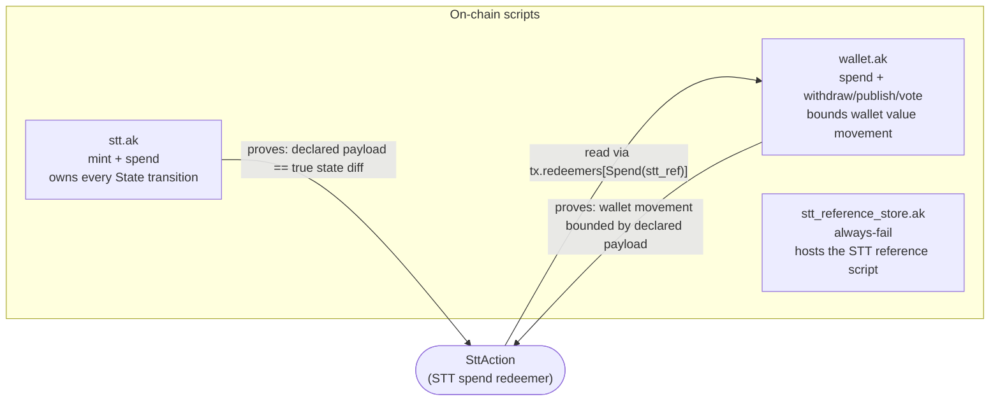
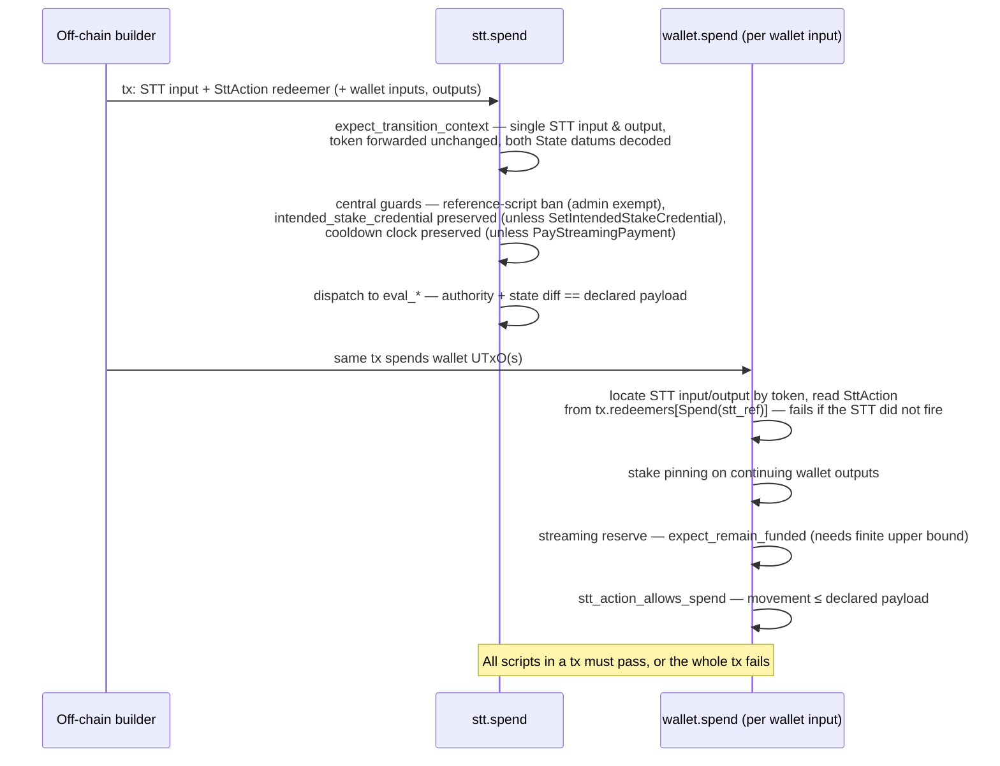
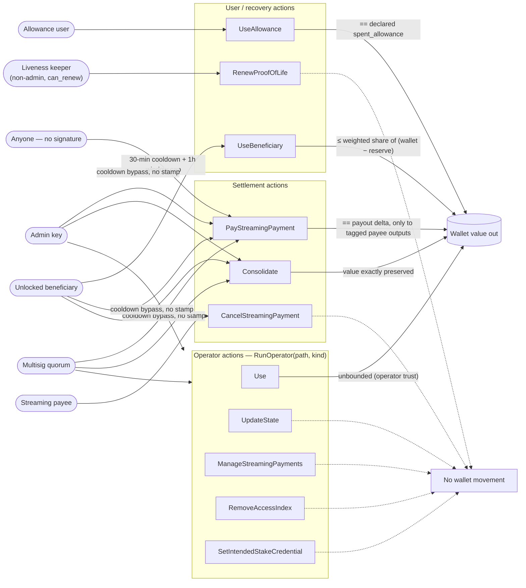

# Interaction Map & Path Audit

Every way any actor can interact with the deployed contracts, drawn as diagrams
and then audited path by path. This is a **code-level map**: it documents what
the validators enforce and where, with pointers into the source and test suite.
The *rationale* behind each rule (threat model, formal invariants, accepted
trade-offs) lives in the [whitepaper](../../whitepaper/whitepaper.pdf) — this
file cites its sections but never replaces them.

> **Lockstep rule** (contracts [CLAUDE.md](CLAUDE.md) §7): when an `SttAction`
> variant, a handler, or a cross-cutting guard changes, update this file in the
> same commit.

The diagrams are [Mermaid](https://mermaid.js.org/) — GitHub renders them
inline, so the map lives in the repo and drifts are caught in PR review like
any other code change.

## The three scripts

The redeemer is the single source of truth across both validators.
Composition: STT proves *"declared payload equals true state diff"*; wallet
proves *"wallet movement bounded by declared payload"*. Net: **wallet movement
is bounded by the true state diff** (whitepaper Formal Model — "The two
validators", Bounded-movement theorem).

## The co-firing handshake

Two asymmetries matter for the audit:

- **Wallet without STT: impossible.** `expect_forwarded_stt_output` needs the
  STT spend redeemer; if the STT was not spent in the same tx, the lookup fails
  and no wallet UTxO can move.
- **STT without wallet: allowed, and must be safe on its own.** The wallet
  validator only runs when a wallet UTxO is spent, so every STT branch fully
  contains its own safety (the CO-FIRING INVARIANT comment in
  [stt.ak](validators/stt.ak) — audit A2). Each path audit below has a
  "wallet-less tx" line for exactly this question.

## Interaction map — who can do what

Two more entry points sit outside the `SttAction` dispatch: **mint** (creates a
wallet; audited as P1) and the **governance purposes** `withdraw` / `publish` /
`vote` on the wallet script (audited as P13). Everything else on either script
is a hard `fail` (P14).

## Cross-cutting guards (audited once — apply to every STT spend path)

| # | Guard | Where | What it stops |
| --- | --- | --- | --- |
| G1 | Exactly one STT input and one continuing STT output, matched by **full address**; token (policy + name, qty 1) forwarded unchanged | `io.expect_single_stt_io`, `io.expect_transition_context` | attacker-supplied second STT at the script; token swap/burn; stake re-homing of the STT UTxO itself |
| G2 | Reference-script ban on the forwarded STT output; admin operator actions exempt | `stt.eval_spend` + `io.is_admin_operator_action` | STT UTxO bloat / foreign script pinning; admin can still re-host the STT reference script |
| G3 | `intended_stake_credential` preserved by every action except `SetIntendedStakeCredential` | `stt.eval_spend` (central `expect or`) | any path — even arbitrary `UpdateState` — silently re-targeting wallet delegation |
| G4 | `last_permissionless_payout_at` preserved by every action except `PayStreamingPayment` | `stt.eval_spend` (central `expect or`) | resetting/advancing the crank-cooldown clock from another path |
| G5 | STT value: non-lovelace exactly equal, lovelace may only grow (`stt_value_preserved_or_increased`); admin `Use` exempt, crank stricter (`==`) | `io.stt_value_preserved_or_increased` (argument order is load-bearing — see its doc comment) | draining or junk-flooding the STT UTxO |

Wallet-side cross-cutting guards (apply to **every** wallet spend, before the
per-action rule):

| # | Guard | Where | What it stops |
| --- | --- | --- | --- |
| W1 | Every continuing wallet output carries `State.intended_stake_credential`; inputs deliberately unconstrained | `wallet.expect_wallet_outputs_use_intended_stake` | "Franken address" re-homing of funds' delegation/rewards; inputs stay sweepable |
| W2 | Per-asset streaming reserve: `output ≥ min(input, reserve)` for every spent asset | `funding.expect_remain_funded` | any spend (operator included) draining what payees have already accrued |
| W3 | Value snapshot aggregates by **payment credential** across all wallet UTxOs in the tx | `wallet.collect_wallet_value_snapshot` | applying a per-invocation cap (e.g. beneficiary share) once per stake variant instead of once per tx |

### Validity-bound requirements per path

The tx validity window is a security input; which bounds each path demands is
part of its authority model (`time/bounds` module header records the audited
inclusivity assumption).

| Path | Lower bound | Upper bound |
| --- | --- | --- |
| Mint | – | – |
| RunOperator (any kind), RenewProofOfLife | finite **only if** proof-of-life is renewed (window check) | same; `ManageStreamingPayments` needs a finite upper only to *stop* a stream |
| UseAllowance | finite (reset gate) | finite (next-reset rebase) |
| UseBeneficiary | finite (unlock check — no finite lower ⇒ never unlocked) | – (STT side) |
| PayStreamingPayment | finite (cooldown + accrual floor) | finite (stamp + 1h window cap) |
| CancelStreamingPayment | – | finite (the "now" the end-date is capped at) |
| Consolidate | finite for `BeneficiaryPath` (unlock check) | – (STT side) |
| **Any wallet spend** | – | **always finite** (`expect_remain_funded` needs it) |

## Path-by-path audit

Format per path: entry point → authority → what may change → guards verified in
source → abuse analysis → wallet-less containment → regression tests → verdict.
"Intentional" flags behavior that looks surprising but is documented at the
code site and in the whitepaper's *Limitations and Trust Assumptions*.

### P1 — Mint (create a wallet)

- **Entry:** `stt.mint` → `eval_mint` ([stt.ak](validators/stt.ak))
- **Authority:** anyone (creating a wallet needs no permission; all authority is in the State being minted)
- **Guards:** exactly one STT output at the STT script, enterprise address (stake `None` — immutable for the wallet's life, audit B-4), no reference script, inline `State` datum; token name = `blake2b_256(consumed input ref)` (uniqueness); mint pinned to exactly one token, quantity 1, name equal to the output's (audit I-5); `expect_valid_state_configuration` (caps, unique ids, reachable recovery path); `last_permissionless_payout_at == None` (fresh cooldown clock).
- **Abuse analysis:** minting a bricked wallet → rejected by recovery-reachability shape check; minting with lapsed `unlock_time` → accepted **(intentional — "shape, not timing"; off-chain warns)**; double-mint under one policy in one tx → single-output + single-name pins reject it.
- **Tests:** `stt_mint_tests.ak`, `config_cap_tests.ak`, `security_attack_log_tests.ak`.
- **Verdict:** ✅ sound; two documented intentional caveats (timing not checked, permissionless creation).

### P2 — RunOperator(Use): operator spends the wallet

- **Entry:** `stt.spend` → `operator_handlers.eval_operator_use`; wallet arm: `RunOperator.kind == Use`
- **Authority:** admin signature, or multisig power ≥ threshold (`authorization.has_operator_authority`)
- **May change:** proof-of-life `unlock_time` only (renewal optional, window-checked when present); wallet: **any movement** (operator trust)
- **Guards:** operator authority; `state_unchanged_except_pol_unlock_time`; renewal window; STT value preserved **unless admin** (carve-out so admin can reshape the STT UTxO's own assets).
- **Abuse analysis:** non-operator forging `Use` → authority gate; renewing `unlock_time` beyond `increment` → window check; wallet drain by operator → **intentional** (trust model); operator spend leaving payees unfunded → blocked wallet-side by W2. `Use` **not** forcing renewal is the documented advisory-proof-of-life trade-off (README §Role Model, whitepaper caveat box) — off-chain owns liveness.
- **Wallet-less tx:** admin can reshape only the STT UTxO's min-ADA-tier contents; wallet funds untouched by definition.
- **Tests:** `stt_operator_tests.ak`, `wallet_spend_tests.ak`, `stt_spend_value_tests.ak`.
- **Verdict:** ✅ sound; operator-trust and advisory-liveness are documented design.

### P3 — RunOperator(UpdateState): full reconfiguration

- **Entry:** `operator_handlers.eval_operator_state_update`; wallet arm: no spend
- **Authority:** admin or multisig quorum
- **May change:** entire access record + proof-of-life settings; wallet_name (admin only); streaming payments must be forwarded exactly
- **Guards:** full `expect_valid_state_configuration` on the output (caps, unique ids, reachability); `are_forwarded` (no payee erased/clawed back); authority; STT value preserved. G3/G4 keep the stake credential and cooldown clock out of reach.
- **Abuse analysis:** multisig evicting the admin → **intentional** (co-equal recovery authority); setting `unlock_time` into the past → **intentional** (reconfiguration path skips the increment cap — handler doc comment, audit A4); sneaking in a bloated state → inner-collection caps (audit A1).
- **Tests:** `stt_operator_tests.ak`, `config_cap_tests.ak`, `security_attack_log_tests.ak`.
- **Verdict:** ✅ sound; the two "surprising" powers are documented operator-trust consequences.

### P4 — RunOperator(ManageStreamingPayments)

- **Entry:** `operator_handlers.eval_manage_streaming_payments`; wallet arm: no spend
- **Authority:** admin or multisig quorum
- **May change:** streaming payments (extend / stop-at-"now" / add new, born unsettled) + optional proof-of-life renewal
- **Guards:** `shape.expect_valid` on the grown set (count cap 25, unique ids, per-entry validity); `are_forwarded_rescheduled_or_added` — existing entries never dropped, immutable fields + `paid_out_amount` pinned, `end_date` floor = `min(end_date, tx_latest)` (no clawback); adds must have `paid_out_amount == 0`; renewal window; authority; STT value preserved.
- **Abuse analysis:** clawing back accrued value by shrinking `end_date` below "now" → floor rejects; deleting a payment → forwarding rejects (settlement is the only exit); unbounded tx faking "now" → `None` upper bound degrades the floor to `end_date` (extend-only).
- **Tests:** `streaming_payments_tests.ak`, `stt_operator_tests.ak`.
- **Verdict:** ✅ sound; reserve stays honest because it is recomputed from live State on every spend.

### P5 — RunOperator(RemoveAccessIndex)

- **Entry:** `operator_handlers.eval_remove_access_index`; wallet arm: no spend
- **Authority:** admin or multisig quorum
- **May change:** exactly one user or beneficiary entry, by index
- **Guards:** authority; `state_unchanged_except_access_index_removed` (output == input minus index, length must shrink by exactly 1 — out-of-range index is a no-op caught by the length check); `has_reachable_access_path` re-checked (the only invariant a removal can break — removal cannot create duplicates/invalid allowances); STT value preserved.
- **Abuse analysis:** removing the last recovery path → reachability recheck rejects; using removal to bypass full validation → safe by construction (subset of a valid set + the one recheck); cap-exempt on purpose so an over-cap wallet can always shrink (audit / Security Analysis "Bounded execution cost").
- **Tests:** `remove_access_index_tests.ak`.
- **Verdict:** ✅ sound; the skipped full re-validation is justified and documented at the code site.

### P6 — RunOperator(SetIntendedStakeCredential)

- **Entry:** `operator_handlers.eval_set_intended_stake_credential`; wallet arm: no spend
- **Authority:** admin or multisig quorum
- **May change:** only `intended_stake_credential`, to exactly the declared target
- **Guards:** authority; `state_unchanged_except_intended_stake_credential` (all normal fields pinned) + `output.intended_stake_credential == target`; this action is G3's single exemption; STT value preserved.
- **Abuse analysis:** any *other* path changing the credential → G3; smuggling extra changes into this path → preservation helper pins everything else.
- **Tests:** `wallet_rule_tests.ak` / `security_attack_log_tests.ak` (stake-pinning cases), `guard_isolation_tests.ak`.
- **Verdict:** ✅ sound — the pairing of a central preservation guard with one narrowly-scoped mutator is the cleanest pattern in the codebase.

### P7 — RenewProofOfLife (heartbeat)

- **Entry:** `user_handlers.eval_renew_proof_of_life`; wallet arm: **no spend** (`False`)
- **Authority:** a **non-admin** user with `can_renew_proof_of_life`, by signature
- **May change:** `unlock_time` only, forward, within one `increment`, landing ≥ tx upper bound
- **Guards:** `proof_of_life_user_signature_matches` (non-admin + flag + signed); `state_unchanged_except_pol_unlock_time`; `has_valid_renewal_window` (finite range required, no decrease, ≤ earliest + increment).
- **Abuse analysis:** keeper deferring beneficiary unlock forever → **intentional** (keeper outranks recovery — whitepaper Recovery-reachability theorem); admin using this path → excluded by design (admins renew via `Use`); replaying a renewal to jump far ahead → increment cap per tx, ratchet only moves forward.
- **Tests:** `stt_operator_tests.ak` (renewal cases), `state_tests.ak` property tests (window boundaries).
- **Verdict:** ✅ sound.

### P8 — UseAllowance (bounded daily spend)

- **Entry:** `user_handlers.eval_use_allowance`; wallet arm: payout `==` declared `spent_allowance`
- **Authority:** signature of the one user whose allowance changed
- **May change:** that user's `remaining_allowance` / `next_allowance_reset` (+ optional PoL renewal by an eligible changed user)
- **Guards:** finite validity range; `state_unchanged_except_users_and_pol_unlock_time`; lockstep user-list walk (no insert/remove/reorder), exactly one changed user; static user fields pinned; reset uses **lower** bound, rebase uses **upper** bound + one full period (velocity floor); post-spend bundle well-formed (dup-key guard) and capped; per-asset draw ≤ effective remaining; declared delta `==` computed delta; STT value preserved.
- **Abuse analysis:** wide validity window faking an early reset → lower-bound gating (see `allowance.remaining_allowance_available_for_use` doc); padding `remaining_allowance` with junk entries → spend-path cap; draining twice via duplicate keys → `entries_are_valid` dup guard; spending more wallet value than declared → wallet arm equality.
- **Tests:** `stt_allowance_tests.ak`, `allowance.ak` co-located property tests, `wallet_rule_tests.ak`.
- **Verdict:** ✅ sound; the boundary arithmetic is the best-covered code in the suite (property tests pin the exact floors).

### P9 — UseBeneficiary (recovery draw)

- **Entry:** `user_handlers.eval_use_beneficiary`; wallet arm: payout ≤ weighted share
- **Authority:** exactly **one** beneficiary that is unlocked (max of its own `unlock_after` and global `unlock_time`, both elapsed vs the tx **lower** bound), signed, and sharing no wallet key with another beneficiary
- **May change:** the acting beneficiary is **removed** (one-shot); nothing else
- **Guards:** `expect_single_beneficiary_with_unlock_authority` (filter must yield exactly one); declared id `==` acting id; `state_unchanged_except_beneficiary_removed`; STT value preserved. Wallet side: `paid_out_within_share` per asset, division-free bound `qty × remaining_weight ≤ weight × pool`, pool = `max(0, input − reserve)`, weights read from the **input** state (pre-removal).
- **Abuse analysis:** double-dip → removal retires the weight; two unlocked beneficiaries colluding in one tx → "exactly one" filter rejects; drawing payee-owed funds → reserve subtracted from the pool, **but only point-in-time** (**intentional** — a beneficiary can choose an early upper bound and draw future accrual; whitepaper "Streaming reserve is point-in-time"); under-drawing forfeits to later actors → intended weighted-share semantics.
- **Tests:** `stt_beneficiary_streaming_tests.ak`, `beneficiary_share.ak` property tests (exact floor), `wallet_fuzz_tests.ak`.
- **Verdict:** ✅ sound; the point-in-time reserve is the one consciously-accepted gap, documented on both sides.

### P10 — PayStreamingPayment (the crank)

- **Entry:** `settlement_handlers.eval_pay_streaming_payment`; wallet arm: payout `==` delta, routed only to tagged outputs, output count ≤ input count
- **Authority:** **none** (permissionless) — but rate-limited; admin / multisig / unlocked beneficiary co-signature bypasses the cooldown without advancing the clock
- **May change:** streaming payments (accrual settled / matured entries removed) + the cooldown stamp (permissionless branch only)
- **Guards (STT):** value strictly `==`; only streaming payments change; **real progress** required (set must differ — anti-churn, audit F-1); finite range; permissionless branch: window ≤ 1 h cap, lower bound ≥ last stamp + 30 min, new stamp = upper bound; authorized branch: stamp **pinned unchanged**; `payout_is_valid` (unique ids, no new ids, per-entry: monotonic `paid_out`, ≤ accrued-at-lower-bound, retained entries must still owe, removals only when matured or fully settled, each positive delta reaches a tagged output bound to *this* STT input ref); declared delta `==` computed.
- **Guards (wallet):** paid-out `==` delta; anti-fragmentation (`output_count ≤ input_count`); `assets_only_reach_matching_outputs` — every payout asset lands only on wallet/STT/correctly-tagged outputs and tagged outputs sum exactly (anti-leak / double-satisfaction; consequence: an ADA-crank burns its fee change — whitepaper "ADA settlement fee funding").
- **Abuse analysis:** STT-thread stalling by no-op cranks → real-progress + cooldown (Settlement-cadence theorem); stamping years ahead to freeze cranks → 1 h window cap + authorized-branch pin (the beneficiary is *inside* this threat model — handler doc comment); paying the wrong party → tag = (payment id, consumed STT ref) is replay-proof per spend; UTxO-dust griefing → count bound.
- **Wallet-less tx:** delta must still reach tagged payee outputs — STT-side `payout_is_valid` carries the routing on its own (co-firing invariant, verified in `guard_isolation_tests.ak`).
- **Tests:** `stt_payout_cooldown_tests.ak`, `stt_beneficiary_streaming_tests.ak`, `streaming_payments_tests.ak`, `wallet_rule_tests.ak`, `guard_isolation_tests.ak`.
- **Verdict:** ✅ sound — the most defended path in the system, proportional to being the only unauthenticated one.

### P11 — CancelStreamingPayment (payee self-cancel)

- **Entry:** `settlement_handlers.eval_cancel_streaming_payment`; wallet arm: **no spend** (`False`)
- **Authority:** signature of the target payment's `payout_address` payment key (a script payee has no self-cancel — operator path instead)
- **May change:** exactly the target payment's `end_date`, down to `min(end_date, tx_latest)` — the same no-clawback floor as the operator stop path (single definition: `forwarding.end_date_floor`)
- **Guards:** target id must exist; payee authority; finite upper bound; only streaming payments change; real progress (one-shot — a second cancel is a no-op and is rejected); `is_payee_cancelled` (every other payment forwarded exactly, length preserved); STT value preserved.
- **Abuse analysis:** payee clawing back already-accrued value → floor makes the cancel forfeit only *future* accrual; payee touching another payment or the state → preservation + exact-forward; cancel-replay to occupy the STT thread → one-shot real-progress guard (same churn class as the crank).
- **Tests:** `stt_cancel_streaming_payment_tests.ak`, `streaming_payments_tests.ak` (`is_payee_cancelled` units).
- **Verdict:** ✅ sound; purely self-affecting by construction.

### P12 — Consolidate (UTxO cleanup / Franken sweep)

- **Entry:** `settlement_handlers.eval_consolidate`; wallet arm: `input_value == output_value`
- **Authority:** admin, multisig, **or** unlocked beneficiary (declared via `ConsolidatePath`)
- **May change:** nothing in State; wallet UTxO *layout* only, value exactly preserved
- **Guards:** `state_completely_unchanged`; `has_consolidate_authority`; STT value preserved; wallet-side exact value equality (which also passes the reserve gate trivially); W1 re-homes swept stray-stake funds onto the intended credential.
- **Abuse analysis:** value exfiltration disguised as consolidation → exact equality; a beneficiary using it pre-unlock → unlock check in the authority; layout griefing → requires authority, unlike the crank.
- **Tests:** `wallet_spend_tests.ak`, `stt_spend_io_tests.ak`.
- **Verdict:** ✅ sound.

### P13 — Governance purposes: withdraw / publish / vote

- **Entry:** `wallet.withdraw|publish|vote` → `eval_governance_operator_use` (one shared gate, no per-purpose wrappers)
- **Authority:** the STT must run `RunOperator(path, Use)` **in the same tx**
- **Guards:** forwarded STT action equality — nothing else. The purpose payloads (`account`, `certificate`, `voter`) are deliberately **not** inspected.
- **Abuse analysis:** withdrawing rewards / voting without operator authority → the STT `Use` spend inside the tx carries the full authority gate; a beneficiary claiming rewards during recovery → **intentional** gap (operator-only rewards — audit I-3; negligible for the default enterprise wallet); payload mischief → off-chain builder is the trust surface, documented in [README](README.md) §Role Model.
- **Tests:** `wallet_governance_tests.ak`.
- **Verdict:** ✅ sound within its documented trust envelope.

### P14 — Always-fail surfaces

- `wallet.mint` → `False` (the wallet owns no minting policy); `stt.else` and `wallet.else` → `fail` (no staking/governance participation under the scripts' own credentials beyond the explicit purposes — STT deposit forgoes rewards, audit A5); `stt_reference_store.spend|else` → `fail` (the locked ADA is permanent; the UTxO exists only to host the STT reference script).
- **Tests:** `stt_reference_store.ak` co-located fail test, `guard_isolation_tests.ak`.
- **Verdict:** ✅ nothing reachable.

## Cross-path interactions

Interactions *between* paths are where single-path audits go blind; these are
the pairs worth re-checking whenever either side changes:

| Pair | Interaction | Resolution |
| --- | --- | --- |
| Crank ↔ Renewal | Both consume the single STT thread; unauthenticated cranks could stall heartbeats until the dead-man-switch lapses | real-progress guard + 30-min cooldown + 1 h stamp cap (P10); Settlement-cadence theorem |
| Beneficiary ↔ Payee | A recovery draw could take value payees accrued | reserve subtracted from the pool (P9/W2) — point-in-time only, documented gap |
| Beneficiary ↔ Crank | Recovery must settle every stream before the terminal sweep | unlocked beneficiary gets the cooldown bypass *without* stamping (P10) |
| Multisig ↔ Admin | Quorum can rewrite access, including evicting the admin | intentional co-equal recovery authority (P3) |
| Operator ↔ Keeper ↔ Beneficiary | Authority ordering: operators and keeper outrank recovery; lost keeper ⇒ lapse ⇒ unlock | Recovery-reachability theorem; keeper is a trusted role (P7) |
| Anyone ↔ Wallet address | Deposits under a foreign stake credential ("Franken") | funds stay locked; W1 pins continuing outputs; `Consolidate` sweeps them back (P12) |
| Governance ↔ Use | withdraw/publish/vote piggyback on the same `Use` authority in one tx | single shared gate; payloads out of scope by design (P13) |
| Shared keys across records | One key in two multisig-powered user records double-counts its power | intentional but sharp — config UI must surface it; see `authorization.ak` FOOTGUN note |

## Audit summary

| Path | Authority | Wallet effect | Verdict |
| --- | --- | --- | --- |
| P1 Mint | anyone | – | ✅ (timing unchecked — intentional) |
| P2 Use | admin / multisig | unbounded | ✅ (operator trust; advisory liveness) |
| P3 UpdateState | admin / multisig | none | ✅ (admin evictable; past unlock — intentional) |
| P4 ManageStreamingPayments | admin / multisig | none | ✅ |
| P5 RemoveAccessIndex | admin / multisig | none | ✅ |
| P6 SetIntendedStakeCredential | admin / multisig | none | ✅ |
| P7 RenewProofOfLife | liveness keeper | none | ✅ (keeper outranks recovery) |
| P8 UseAllowance | changed user | == declared | ✅ |
| P9 UseBeneficiary | single unlocked beneficiary | ≤ weighted share | ✅ (point-in-time reserve) |
| P10 PayStreamingPayment | anyone (rate-limited) | == delta, tagged only | ✅ |
| P11 CancelStreamingPayment | the payee | none | ✅ |
| P12 Consolidate | admin / multisig / beneficiary | value preserved | ✅ |
| P13 withdraw / publish / vote | operator `Use` co-fire | n/a (reward account) | ✅ (operator-only rewards) |
| P14 everything else | – | – | ✅ hard fail |

No new findings: every surprising behavior encountered in this pass is already
documented at its code site and in the whitepaper's *Limitations and Trust
Assumptions* (advisory proof-of-life, shape-not-timing recovery, point-in-time
reserve, operator-only rewards, per-record multisig power, ADA-crank fee burn).
The audit's value is the map itself: each path now has a checklist to re-run
when it changes.
