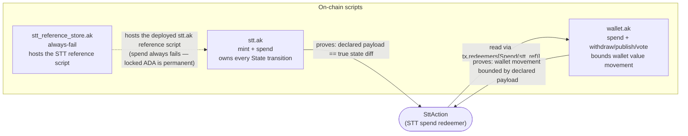
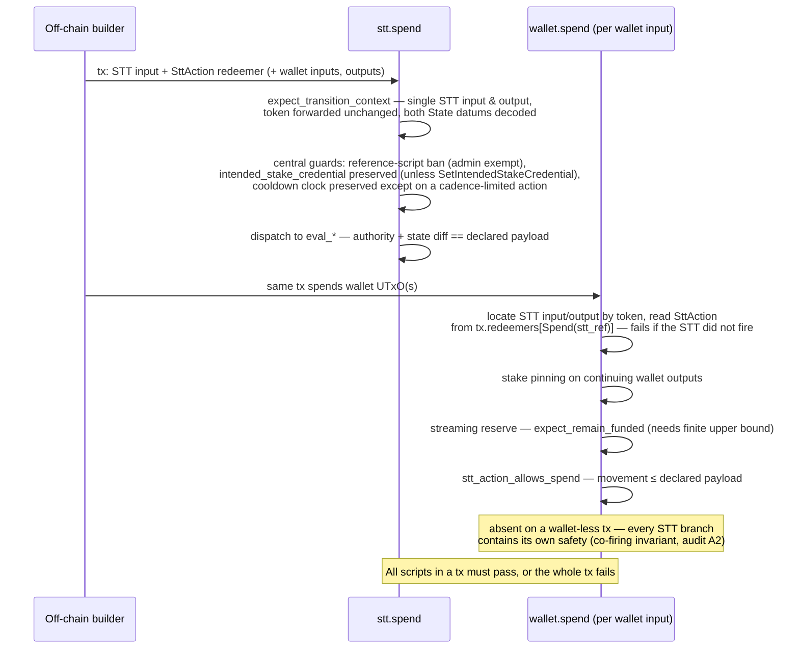
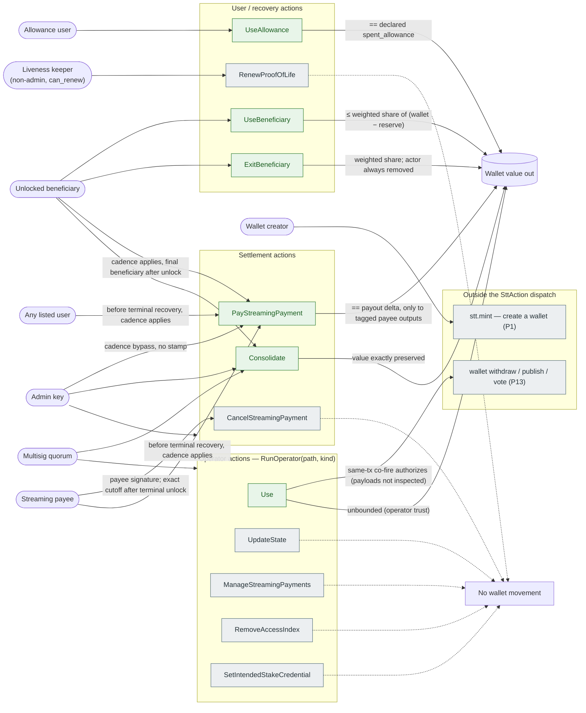
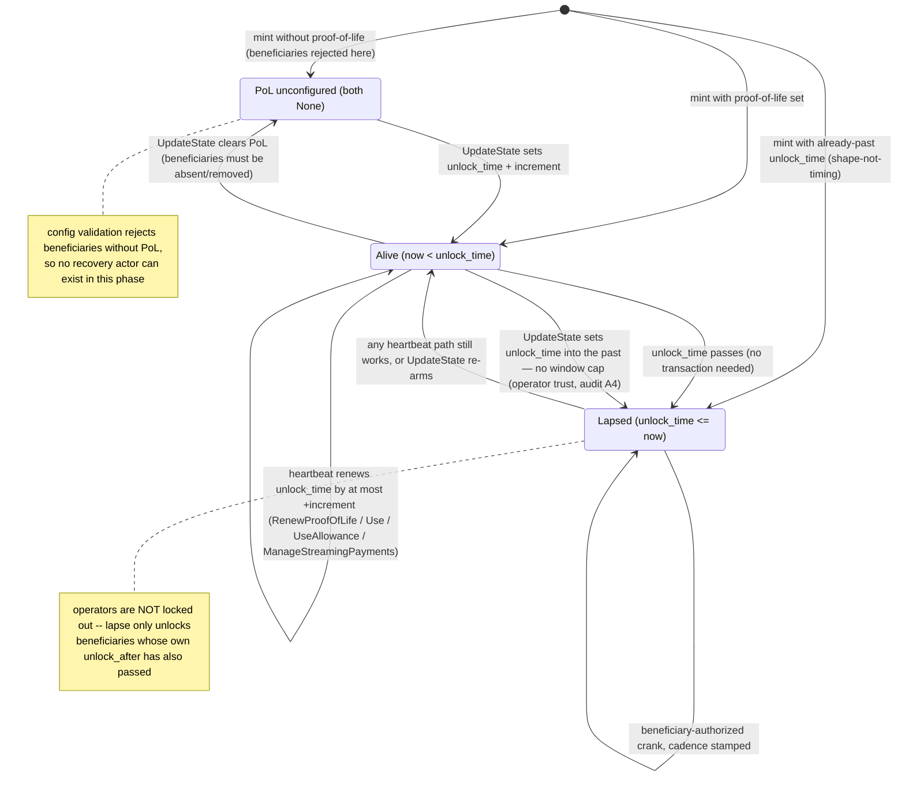
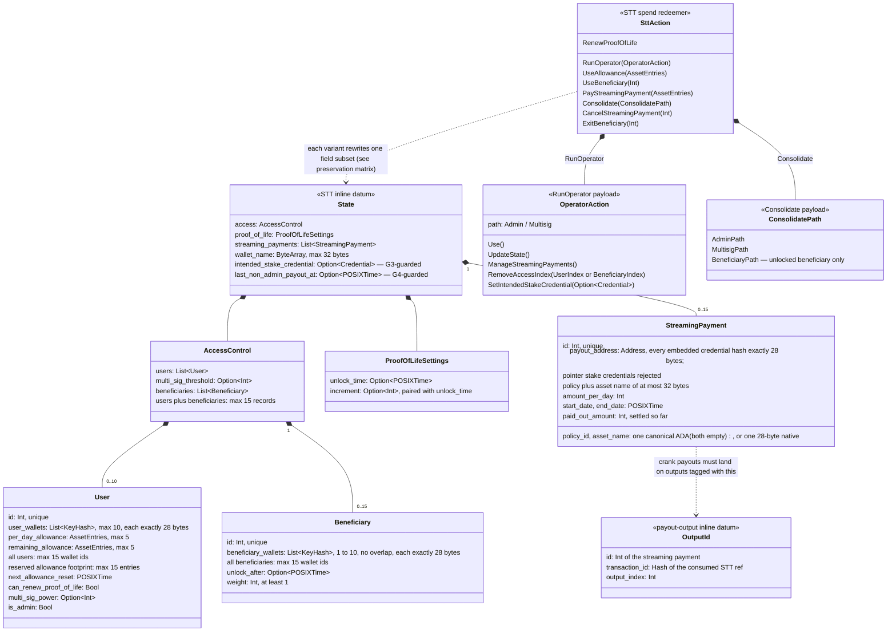

# Interaction Map & Path Audit

Every way any actor can interact with the deployed contracts, drawn as diagrams
and then audited path by path. This is a **code-level map**: it documents what
the validators enforce and where, with pointers into the source and test suite.
The *rationale* behind each rule (threat model, formal invariants, accepted
trade-offs) lives in the [whitepaper](../../whitepaper/whitepaper.pdf) — this
file cites its sections but never replaces them.

> **Lockstep rule** (contracts [CLAUDE.md](CLAUDE.md) §7): when an `SttAction`
> variant, a handler, or a cross-cutting guard changes, update this file in the
> same commit.

The diagrams are [Mermaid](https://mermaid.js.org/) — GitHub renders them
inline, so the map lives in the repo and drifts are caught in PR review like
any other code change.

## The three scripts

```mermaid
flowchart LR
  subgraph onchain["On-chain scripts"]
    STT["stt.ak<br/>mint + spend<br/>owns every State transition"]
    WAL["wallet.ak<br/>spend + withdraw/publish/vote<br/>bounds wallet value movement"]
    REF["stt_reference_store.ak<br/>always-fail<br/>hosts the STT reference script"]
  end
  RED(["SttAction<br/>(STT spend redeemer)"])
  STT -- "proves: declared payload == true state diff" --> RED
  RED -- "read via tx.redeemers[Spend(stt_ref)]" --> WAL
  WAL -- "proves: wallet movement bounded by declared payload" --> RED
  REF -. "hosts the deployed stt.ak reference script<br/>(spend always fails — locked ADA is permanent)" .-> STT
```

The redeemer is the single source of truth across both validators.
Composition: STT proves *"declared payload equals true state diff"*; wallet
proves *"wallet movement bounded by declared payload"*. Net: **wallet movement
is bounded by the true state diff** (whitepaper Formal Model — "The two
validators", Bounded-movement theorem).

## The co-firing handshake

```mermaid
sequenceDiagram
  participant B as Off-chain builder
  participant S as stt.spend
  participant W as wallet.spend (per wallet input)
  B->>S: tx: STT input + SttAction redeemer (+ wallet inputs, outputs)
  S->>S: expect_transition_context — single STT input & output,<br/>token forwarded unchanged, both State datums decoded
  S->>S: central guards: reference-script ban (admin exempt),<br/>intended_stake_credential preserved (unless SetIntendedStakeCredential),<br/>cooldown clock preserved except on a cadence-limited action
  S->>S: dispatch to eval_* — authority + state diff == declared payload
  B->>W: same tx spends wallet UTxO(s)
  W->>W: locate STT input/output by token, read SttAction<br/>from tx.redeemers[Spend(stt_ref)] — fails if the STT did not fire
  W->>W: stake pinning on continuing wallet outputs
  W->>W: streaming reserve — expect_remain_funded (needs finite upper bound)
  W->>W: stt_action_allows_spend — movement ≤ declared payload
  Note over W: absent on a wallet-less tx — every STT branch<br/>contains its own safety (co-firing invariant, audit A2)
  Note over S,W: All scripts in a tx must pass, or the whole tx fails
```

Two asymmetries matter for the audit:

- **Wallet without STT: impossible.** `expect_forwarded_stt_output` needs the
  STT spend redeemer; if the STT was not spent in the same tx, the lookup fails
  and no wallet UTxO can move.
- **STT without wallet: allowed, and must be safe on its own.** The wallet
  validator only runs when a wallet UTxO is spent, so every STT branch fully
  contains its own safety (the CO-FIRING INVARIANT comment in
  [stt.ak](validators/stt.ak) — audit A2). Each path audit below has a
  "wallet-less tx" line for exactly this question.

## Interaction map — who can do what

```mermaid
flowchart LR
  ADM(["Admin key"])
  MS(["Multisig quorum"])
  ALW(["Allowance user"])
  KPR(["Liveness keeper<br/>(non-admin, can_renew)"])
  LST(["Any listed user"])
  BEN(["Unlocked beneficiary"])
  PAY(["Streaming payee"])
  CRE(["Wallet creator"])

  subgraph OPS["Operator actions — RunOperator(path, kind)"]
    USE["Use"]
    UPD["UpdateState"]
    MSP["ManageStreamingPayments"]
    RAI["RemoveAccessIndex"]
    SIC["SetIntendedStakeCredential"]
  end
  subgraph USR["User / recovery actions"]
    RPL["RenewProofOfLife"]
    UAL["UseAllowance"]
    UBE["UseBeneficiary"]
    EBE["ExitBeneficiary"]
  end
  subgraph SET["Settlement actions"]
    PSP["PayStreamingPayment"]
    CSP["CancelStreamingPayment"]
    CON["Consolidate"]
  end
  subgraph EXT["Outside the SttAction dispatch"]
    MINT["stt.mint — create a wallet (P1)"]
    GOV["wallet withdraw / publish / vote (P13)"]
  end

  CRE --> MINT
  USE -- "same-tx co-fire authorizes (payloads not inspected)" --> GOV
  ADM --> OPS
  MS --> OPS
  KPR --> RPL
  ALW --> UAL
  BEN --> UBE
  BEN --> EBE
  PAY -- "payee signature; exact cutoff after terminal unlock" --> CSP
  LST -- "before terminal recovery, cadence applies" --> PSP
  PAY -- "before terminal recovery, cadence applies" --> PSP
  BEN -- "cadence applies, final beneficiary after unlock" --> PSP
  ADM -- "cadence bypass, no stamp" --> PSP
  ADM --> CON
  MS --> CON
  BEN --> CON

  W[("Wallet value out")]
  USE -- "unbounded (operator trust)" --> W
  UAL -- "== declared spent_allowance" --> W
  UBE -- "≤ weighted share of (wallet − reserve)" --> W
  EBE -- "weighted share; actor always removed" --> W
  PSP -- "== payout delta, only to tagged payee outputs" --> W
  NOX["No wallet movement"]
  UPD -.-> NOX
  MSP -.-> NOX
  RAI -.-> NOX
  SIC -.-> NOX
  RPL -.-> NOX
  CSP -.-> NOX
  CON -- "value exactly preserved" --> W

  classDef moves fill:#e8f5e9,stroke:#2e7d32,color:#1b5e20
  classDef nomove fill:#eceff1,stroke:#546e7a,color:#263238
  class USE,UAL,UBE,EBE,PSP,CON moves
  class UPD,MSP,RAI,SIC,RPL,CSP,MINT,GOV nomove
```

Green nodes may spend wallet UTxOs; grey nodes never touch them. The map
includes the two entry points outside the `SttAction` dispatch: **mint**
(creates a wallet; audited as P1) and the **governance purposes** `withdraw` /
`publish` / `vote` on the wallet script, which move reward-account/certificate
state but no wallet UTxOs (audited as P13). Everything else on either script is
a hard `fail` (P14).

## Wallet lifecycle — which paths are live when

The actor map above is time-blind; this is the missing dimension. The
proof-of-life clock partitions the wallet's life into three phases, and the
recovery paths only exist in one of them. Two facts frame the whole diagram:
the STT is **immortal** (there is no burn path — whitepaper "Permanent state
thread"), and lapsing **adds** actors without removing any (operators keep full
authority in every phase).

```mermaid
stateDiagram-v2
    state "PoL unconfigured (both None)" as U
    state "Alive (now < unlock_time)" as A
    state "Lapsed (unlock_time <= now)" as L

    [*] --> U : mint without proof-of-life (beneficiaries rejected here)
    [*] --> A : mint with proof-of-life set
    [*] --> L : mint with already-past unlock_time (shape-not-timing)

    U --> A : UpdateState sets unlock_time + increment
    A --> U : UpdateState clears PoL (beneficiaries must be absent/removed)
    A --> A : heartbeat renews unlock_time by at most +increment (RenewProofOfLife / Use / UseAllowance / ManageStreamingPayments)
    A --> L : unlock_time passes (no transaction needed)
    A --> L : UpdateState sets unlock_time into the past — no window cap (operator trust, audit A4)
    L --> A : any heartbeat path still works, or UpdateState re-arms
    L --> L : UseBeneficiary, earlier actor removed
    L --> L : final UseBeneficiary, actor retained, cadence stamped
    L --> L : ExitBeneficiary removes actor, final exit stamps cadence
    L --> L : beneficiary-authorized Consolidate
    L --> L : beneficiary-authorized crank, cadence stamped

    note right of U
      config validation rejects beneficiaries without PoL,
      so no recovery actor can exist in this phase
    end note
    note right of L
      operators are NOT locked out -- lapse only unlocks
      beneficiaries whose own unlock_after has also passed
    end note
```

Audit reading of the diagram: `UseBeneficiary`, `BeneficiaryPath` consolidation,
and the beneficiary arm of the crank's authority gate are reachable **only** in
`Lapsed`. The beneficiary's own `unlock_after` must also have elapsed (P9).
Final-beneficiary recovery and beneficiary cranks use the shared cadence.
Once the sole final beneficiary unlocks, only an admin or that beneficiary may
crank. A payee may still cancel its own payment, but it must use the exact safe
cutoff. Consolidation does not need the final beneficiary's signature. Only an
admin payout bypasses that cadence (P10). The
`Lapsed → Alive` edge is why the liveness keeper
"outranks" recovery (P7), the born-`Lapsed` edge is the documented
shape-not-timing acceptance from P1, and the operator `Alive → Lapsed` edge is
the A4 consequence of `UpdateState` skipping the increment window entirely (P3).

## The on-chain data model

What the paths actually mutate. The two datum fields guarded centrally
(G3/G4) rather than per-handler are marked; `SttAction` payload semantics are
what the wallet validator bounds against (P2/P8/P9/P10).

```mermaid
classDiagram
    class State {
      <<STT inline datum>>
      access: AccessControl
      proof_of_life: ProofOfLifeSettings
      streaming_payments: List~StreamingPayment~
      wallet_name: ByteArray, max 32 bytes
      intended_stake_credential: Option~Credential~ — G3-guarded
      last_non_admin_payout_at: Option~POSIXTime~ — G4-guarded
    }
    class AccessControl {
      users: List~User~
      multi_sig_threshold: Option~Int~
      beneficiaries: List~Beneficiary~
      users plus beneficiaries: max 15 records
    }
    class User {
      id: Int, unique
      user_wallets: List~KeyHash~, max 10, each exactly 28 bytes
      per_day_allowance: AssetEntries, max 5
      remaining_allowance: AssetEntries, max 5
      all users: max 15 wallet ids
      reserved allowance footprint: max 15 entries
      next_allowance_reset: POSIXTime
      can_renew_proof_of_life: Bool
      multi_sig_power: Option~Int~
      is_admin: Bool
    }
    class Beneficiary {
      id: Int, unique
      beneficiary_wallets: List~KeyHash~, 1 to 10, no overlap, each exactly 28 bytes
      all beneficiaries: max 15 wallet ids
      unlock_after: Option~POSIXTime~
      weight: Int, at least 1
    }
    class ProofOfLifeSettings {
      unlock_time: Option~POSIXTime~
      increment: Option~Int~, paired with unlock_time
    }
    class StreamingPayment {
      id: Int, unique
      payout_address: Address, every embedded credential hash exactly 28 bytes;
        pointer stake credentials rejected
      policy_id, asset_name: one canonical ADA (both empty), or one 28-byte native
        policy plus asset name of at most 32 bytes
      amount_per_day: Int
      start_date, end_date: POSIXTime
      paid_out_amount: Int, settled so far
    }
    class SttAction {
      <<STT spend redeemer>>
      RunOperator(OperatorAction)
      RenewProofOfLife
      UseAllowance(AssetEntries)
      UseBeneficiary(Int)
      PayStreamingPayment(AssetEntries)
      Consolidate(ConsolidatePath)
      CancelStreamingPayment(Int)
      ExitBeneficiary(Int)
    }
    class OperatorAction {
      <<RunOperator payload>>
      path: Admin / Multisig
      Use()
      UpdateState()
      ManageStreamingPayments()
      RemoveAccessIndex(UserIndex or BeneficiaryIndex)
      SetIntendedStakeCredential(Option~Credential~)
    }
    class ConsolidatePath {
      <<Consolidate payload>>
      AdminPath
      MultisigPath
      BeneficiaryPath — unlocked beneficiary only
    }
    class OutputId {
      <<payout-output inline datum>>
      id: Int of the streaming payment
      transaction_id: Hash of the consumed STT ref
      output_index: Int
    }

    State *-- AccessControl
    State *-- ProofOfLifeSettings
    State "1" *-- "0..15" StreamingPayment
    AccessControl "1" *-- "0..10" User
    AccessControl "1" *-- "0..15" Beneficiary
    SttAction *-- OperatorAction : RunOperator
    SttAction *-- ConsolidatePath : Consolidate
    SttAction ..> State : each variant rewrites one field subset (see preservation matrix)
    StreamingPayment ..> OutputId : crank payouts must land on outputs tagged with this
```

The caps in parentheses are the execution-budget bounds from
[constants.ak](lib/constants.ak) (audit A1); the per-action "which fields may
change" matrix is maintained in the [preservation.ak](lib/stt/preservation.ak)
module header, and `streaming_payments/types.core_fields_match` owns the
always-immutable `StreamingPayment` field set.

Each streaming schedule names exactly one asset. The contract sets no global
wallet-input, general transaction-input, general output, ordinary redeemer, or
positive-schedule payout count. `UseAllowance`, `UseBeneficiary`, and
`PayStreamingPayment` still limit continuing wallet outputs to consumed wallet
inputs. Serialized byte size, combined ExUnits, and action-specific limits
decide which other transaction shape fits. A builder can retry with a smaller
payout batch or fewer wallet inputs.

## Cross-cutting guards (audited once — apply to every STT spend path)

| # | Guard | Where | What it stops |
| --- | --- | --- | --- |
| G1 | Exactly one STT input and one continuing STT output, matched by **full address**; token (policy + name, qty 1) forwarded unchanged | `io.expect_single_stt_io`, `io.expect_transition_context` | attacker-supplied second STT at the script; token swap/burn; stake re-homing of the STT UTxO itself |
| G2 | Reference-script ban on the forwarded STT output; admin operator actions exempt | `stt.eval_spend` + `io.is_admin_operator_action` | STT UTxO bloat / foreign script pinning; admin can still re-host the STT reference script |
| G3 | `intended_stake_credential` preserved by every action except `SetIntendedStakeCredential` | `stt.eval_spend` (central `expect or`) | any path — even arbitrary `UpdateState` — silently re-targeting wallet delegation |
| G4 | `last_non_admin_payout_at` preserved except by non-admin `PayStreamingPayment`, `CancelStreamingPayment`, and final-beneficiary recovery or exit | `stt.eval_spend` (central `expect or`) | resetting or advancing the shared cadence clock from another path |
| G5 | The forwarded STT output contains only ADA and one STT. A non-admin path preserves its native-asset shape and can only add ADA. An admin operator action may remove legacy native assets or change ADA, but cannot forward or add native assets. The payout path keeps the full value equal. | `io.expect_stt_token_is_forwarded_unchanged`, `io.stt_value_preserved_or_increased` | draining or junk-flooding the STT UTxO |

Wallet-side cross-cutting guards (apply to **every** wallet spend, before the
per-action rule):

| # | Guard | Where | What it stops |
| --- | --- | --- | --- |
| W1 | Every continuing wallet output carries `State.intended_stake_credential`, has no reference script, and uses `NoDatum` or `InlineDatum`. The guard rejects `DatumHash` and pointer stake credentials. Input datums remain unrestricted. | `stake_pinning.expect_wallet_outputs_are_well_formed` | Foreign stake credentials, reference-script bloat, and hashed continuations with unavailable preimages. Legacy hashed inputs still need their preimages under ledger rules. |
| W2 | Per-asset streaming reserve: `output ≥ min(input, reserve)`. Routine bounded paths check only spent assets. Uncapped owner cleanup and repeatable final recovery scan the normalized reserve against aggregate input and output Values. **`PayStreamingPayment` is exempt** because its outflow is already pinned to tagged payee outputs. Applying the floor deadlocked settlement for an under-funded wallet. | `funding.remains_funded`, `funding.reserve_assets_remain_funded`, exemption in `validators/wallet.ak` | any DISCRETIONARY spend (operator included) draining what payees have already accrued |
| W3 | Value snapshot aggregates by **payment credential** across all wallet UTxOs in the tx | `wallet/io.collect_wallet_value_snapshot` | applying a per-invocation cap (e.g. beneficiary share) once per stake variant instead of once per tx |
| W4 | Wallet spends have no fixed wallet-input count. The least input reference runs the full aggregate check. Other wallet inputs take the same-script leader fast path. | `validators/wallet.ak` | Ledger byte size and combined ExUnits decide how many wallet inputs fit without duplicating the full aggregate check. |
| W5 | Wallet inputs, outputs, and aggregate Values have no native-asset count cap. `UseAllowance` limits the declared draw through the five-entry allowance bundle. Exact subtraction preserves every asset outside that draw. `UseBeneficiary` still limits each withdrawn asset to the actor's weighted share. | `state/allowance.expect_allowance_updates`, `wallet/rules.stt_action_allows_spend`, `wallet/beneficiary_share.paid_out_within_share` | Ledger byte size and combined ExUnits limit transaction shapes. Earlier beneficiaries still leave the access list after one use, even if other wallet UTxOs remain. |

### Allowance entries and wallet assets

**VERIFIED implementation:** The five-entry limit applies to each stored daily
or remaining allowance bundle. ADA counts as one entry when present. This
limits the allowance data that later State transitions must process. The
declared withdrawal also has a five-entry check and must equal the allowance
decrease. Removing that check alone would not increase the available allowance.
See `lib/constants.ak:106`, `lib/state/configuration.ak:124`,
`lib/state/allowance.ak:183`, and `lib/stt/user_handlers.ak:70`.

Wallet inputs and continuing outputs have no corresponding asset-count cap.
For example, an input can contain ADA and 20 native assets. An allowance draw
of ADA and token A uses two allowance entries. Every other asset and every
unwithdrawn quantity must remain in the wallet. Authorization and streaming
reserve checks still apply. Ledger size and execution limits can reject a
transaction with a large input even when the draw is small.

The configured limit is five. These checks do not establish that five is the
largest safe allowance size. Changing the stored allowance limit requires a
separate budget review of later State transitions.

### Validity-bound requirements per path

The tx validity window is a security input; which bounds each path demands is
part of its authority model (`time/bounds` module header records the audited
inclusivity assumption).

| Path | Lower bound | Upper bound |
| --- | --- | --- |
| Mint | – | – |
| RunOperator(Use / ManageStreamingPayments), RenewProofOfLife | finite **only if** `unlock_time` changes (renewal window check; unchanged ⇒ no bound required) | same; `ManageStreamingPayments` also needs a finite upper to *stop* a stream (unbounded ⇒ extend-only) |
| RunOperator(UpdateState / RemoveAccessIndex / SetIntendedStakeCredential) | – | – (`UpdateState` may set `unlock_time` freely with **no** window check — P3/audit A4; the other two cannot touch it) |
| UseAllowance | finite (reset gate) | finite (next-reset rebase) |
| UseBeneficiary | finite (unlock check; final recovery also checks cadence) | finite for final recovery (stamp + 1h window cap) |
| ExitBeneficiary | finite (unlock check; final exit also checks cadence) | finite for final exit (stamp + 1h window cap) |
| PayStreamingPayment | finite (cadence + accrual floor) | finite (stamp + 1h window cap) |
| CancelStreamingPayment | finite (shared cadence gate) | finite (end-date floor + stamp + 1h window cap) |
| Consolidate | finite for `BeneficiaryPath` (unlock check) | – (STT side) |
| **Any wallet spend** | – | **always finite** (`expect_remain_funded` needs it) |

## Path-by-path audit

Format per path: entry point → authority → what may change → guards verified in
source → abuse analysis → wallet-less containment → regression tests → verdict.
"Intentional" flags behavior that looks surprising but is documented at the
code site and in the whitepaper's *Limitations and Trust Assumptions*.

### P1 — Mint (create a wallet)

- **Entry:** `stt.mint` → `eval_mint` ([stt.ak](validators/stt.ak))
- **Authority:** anyone (creating a wallet needs no permission; all authority is in the State being minted — the mint redeemer itself is ignored)
- **Guards:** exactly one STT output at the STT script, enterprise address (stake `None` — immutable for the wallet's life, audit B-4), no reference script, inline `State` datum; token name = `blake2b_256(consumed input ref)` (uniqueness); mint pinned to exactly one token, quantity 1, name equal to the output's (audit I-5); `expect_valid_state_configuration` (caps, unique ids, reachable recovery path); `last_non_admin_payout_at == None` (fresh cooldown clock).
- **Abuse analysis:** minting a bricked wallet → rejected by recovery-reachability shape check; minting with lapsed `unlock_time` → accepted **(intentional — "shape, not timing"; off-chain warns)**; double-mint under one policy in one tx → single-output + single-name pins reject it.
- **Tests:** `stt_mint_tests.ak`, `config_cap_tests.ak`, `security_attack_log_tests.ak`.
- **Verdict:** ✅ sound; two documented intentional caveats (timing not checked, permissionless creation).

### P2 — RunOperator(Use): operator spends the wallet

- **Entry:** `stt.spend` → `operator_handlers.eval_operator_use`; wallet arm: `RunOperator.kind == Use`
- **Authority:** admin signature, or multisig power ≥ threshold (`authorization.has_operator_authority`)
- **May change:** proof-of-life `unlock_time` only (renewal optional, window-checked when present); wallet: **any movement** (operator trust)
- **Guards:** operator authority; `state_unchanged_except_pol_unlock_time`; renewal window. The forwarded STT output contains only ADA and one STT. An admin may remove legacy native assets from the input or change its ADA, but cannot forward or add other native assets. Wallet spending must leave each active stream's accrued reserve. Dense owner cleanup uses the normalized full-reserve cursor and does not flatten the wallet Value delta.
- **Abuse analysis:** non-operator forging `Use` → authority gate; renewing `unlock_time` beyond `increment` → window check; wallet drain by operator → **intentional** (trust model); operator spend leaving payees unfunded → blocked wallet-side by W2. `Use` **not** forcing renewal is the documented advisory-proof-of-life trade-off (README §Role Model, whitepaper caveat box) — off-chain owns liveness.
- **Wallet-less tx:** an admin can change STT-output ADA and remove legacy native assets. The output still contains only ADA and one STT. Wallet funds are untouched by definition.
- **Tests:** `stt_operator_tests.ak`, `wallet_spend_tests.ak`, `stt_spend_value_tests.ak`, and `transaction_budget_tests.ak` (`deep_value_underfunded_operator_use`, `near_max_value_underfunded_operator_use`).
- **Verdict:** ✅ sound; operator-trust and advisory-liveness are documented design.

### P3 — RunOperator(UpdateState): full reconfiguration

- **Entry:** `operator_handlers.eval_operator_state_update`; wallet arm: no spend
- **Authority:** admin or multisig quorum
- **May change:** entire access record + proof-of-life settings; wallet_name (admin only); streaming payments must be forwarded exactly
- **Guards:** full `expect_valid_state_configuration` on the output (caps, unique ids, reachability); `are_forwarded` (no payee erased/clawed back); authority; STT value preserved. G3/G4 keep the stake credential and cooldown clock out of reach.
- **Abuse analysis:** multisig evicting the admin → **intentional** (co-equal recovery authority); setting `unlock_time` into the past → **intentional** (reconfiguration path skips the increment cap — handler doc comment, audit A4); sneaking in a bloated state → inner-collection caps (audit A1).
- **Tests:** `stt_operator_tests.ak`, `config_cap_tests.ak`, `security_attack_log_tests.ak`.
- **Verdict:** ✅ sound; the two "surprising" powers are documented operator-trust consequences.

### P4 — RunOperator(ManageStreamingPayments)

- **Entry:** `operator_handlers.eval_manage_streaming_payments`; wallet arm: no spend
- **Authority:** admin or multisig quorum
- **May change:** streaming payments (extend / stop-at-"now" / add new, born unsettled) + optional proof-of-life renewal
- **Guards:** `shape.is_valid` on the grown set (count cap 15, unique ids, ledger-valid asset/address identifiers, per-entry validity). `are_forwarded_rescheduled_or_added` prevents existing entries from being dropped and pins immutable fields plus `paid_out_amount`. For a positive-duration input, the operator `end_date` floor is `max(start_date + 1, min(end_date, tx_latest))` (no clawback; the 1 ms high-rate edge is accepted operator burden). For an existing receiver-created zero-duration input, the floor stays at `start_date`, so management may preserve or extend it without manufacturing 1 ms of accrual. Adds must have `paid_out_amount == 0` and `start_date < end_date`; renewal window; authority; STT value preserved.
- **Abuse analysis:** clawing back accrued value by shrinking `end_date` below "now" → floor rejects; deleting a payment → forwarding rejects (settlement is the only exit); unbounded tx faking "now" → `None` upper bound degrades the floor to `end_date` (extend-only).
- **Tests:** `shape_tests.ak`, `forwarding_tests.ak`, `stt_operator_tests.ak`.
- **Verdict:** ✅ sound; reserve stays honest because it is recomputed from live State on every spend.

### P5 — RunOperator(RemoveAccessIndex)

- **Entry:** `operator_handlers.eval_remove_access_index`; wallet arm: no spend
- **Authority:** admin or multisig quorum
- **May change:** exactly one user or beneficiary entry, by index
- **Guards:** authority; `state_unchanged_except_access_index_removed` (output == input minus index, length must shrink by exactly 1 — out-of-range index is a no-op caught by the length check); `has_reachable_access_path` re-checked (the only invariant a removal can break — removal cannot create duplicates/invalid allowances); STT value preserved.
- **Abuse analysis:** removing the last recovery path → reachability recheck rejects; using removal to bypass full validation → safe by construction (subset of a valid set + the one recheck); the cap exemption lets a decodable over-cap list shrink while each removal fits current execution limits (audit / Security Analysis "Bounded execution cost").
- **Tests:** `remove_access_index_tests.ak`.
- **Verdict:** ✅ sound; the skipped full re-validation is justified and documented at the code site.

### P6 — RunOperator(SetIntendedStakeCredential)

- **Entry:** `operator_handlers.eval_set_intended_stake_credential`; wallet arm: no spend
- **Authority:** admin or multisig quorum
- **May change:** only `intended_stake_credential`, to exactly the declared target
- **Guards:** authority; `state_completely_unchanged` (all normal fields pinned — the credential itself is outside the preservable field set, guarded centrally by G3) + `output.intended_stake_credential == target`; this action is G3's single exemption; STT value preserved.
- **Abuse analysis:** any *other* path changing the credential → G3; smuggling extra changes into this path → preservation helper pins everything else.
- **Tests:** `wallet_rule_tests.ak` / `security_attack_log_tests.ak` (stake-pinning cases), `guard_isolation_tests.ak`.
- **Verdict:** ✅ sound — the pairing of a central preservation guard with one narrowly-scoped mutator is the cleanest pattern in the codebase.

### P7 — RenewProofOfLife (heartbeat)

- **Entry:** `user_handlers.eval_renew_proof_of_life`; wallet arm: **no spend** (`False`)
- **Authority:** a **non-admin** user with `can_renew_proof_of_life`, by signature
- **May change:** `unlock_time` only, forward, within one `increment`, landing ≥ tx upper bound
- **Guards:** `proof_of_life_user_signature_matches` (non-admin + flag + signed); `state_unchanged_except_pol_unlock_time`; **`unlock_time` must actually change** (a no-op renewal is rejected — `expect_valid_renewal_window` passes trivially when it is unchanged, so without this a keeper could replay a bit-identical tx every block to occupy the STT thread); `expect_valid_renewal_window` (finite range required, no decrease, ≤ earliest + increment).
- **Abuse analysis:** keeper deferring beneficiary unlock forever → **intentional** (keeper outranks recovery — whitepaper Recovery-reachability theorem); admin using this path → excluded by design (admins renew via `Use`); replaying a renewal to jump far ahead → increment cap per tx, ratchet only moves forward.
- **Tests:** `stt_operator_tests.ak` (renewal cases), `state_tests.ak` property tests (window boundaries).
- **Verdict:** ✅ sound.

### P8 — UseAllowance (bounded daily spend)

- **Entry:** `user_handlers.eval_use_allowance`; wallet arm: payout `==` declared `spent_allowance`
- **Authority:** signature of the one user whose allowance changed
- **May change:** that user's `remaining_allowance` / `next_allowance_reset` (+ optional PoL renewal by an eligible changed user)
- **Guards:** finite validity range; `state_unchanged_except_users_and_pol_unlock_time`; lockstep user-list walk (no insert/remove/reorder), exactly one changed user; static user fields pinned; reset uses **lower** bound, rebase uses **upper** bound + one full period (velocity floor); post-spend bundle well-formed (dup-key guard) and capped; reserved output footprint `Σ(per_day + max(per_day, remaining)) ≤ 15`; per-asset draw ≤ effective remaining; spent delta must be **non-empty** (a pure reset-rebase that spends nothing is rejected); declared delta `==` computed delta; STT value preserved; continuing wallet outputs do not exceed consumed wallet inputs.
- **Abuse analysis:** wide validity window faking an early reset → lower-bound gating (see `allowance.remaining_allowance_available_for_use` doc); padding or reset growth → reserved footprint cap; draining twice through duplicate keys → `entries_are_valid` duplicate guard; spending more wallet value than declared → wallet arm equality.
- **Tests:** `stt_allowance_tests.ak`, `allowance.ak` co-located property tests, `wallet_rule_tests.ak`.
- **Verdict:** ✅ sound; the boundary arithmetic is the best-covered code in the suite (property tests pin the exact floors).

### P9 — UseBeneficiary (recovery draw)

- **Entry:** `user_handlers.eval_use_beneficiary`; wallet arm: payout ≤ weighted share
- **Authority:** exactly **one** beneficiary that is unlocked (max of its own `unlock_after` and global `unlock_time`, both elapsed vs the tx **lower** bound), signed, and sharing no wallet key with another beneficiary
- **May change:** an earlier acting beneficiary is **removed** (one-shot). The final beneficiary stays in State and advances the shared cadence stamp. No other State field changes.
- **Guards:** `expect_single_beneficiary_with_unlock_authority` (filter must yield exactly one); declared id `==` acting id; `state_unchanged_except_beneficiary_removed` when more than one beneficiary remains; `state_completely_unchanged` plus shared cadence validation for the final beneficiary; STT value preserved. Wallet side: earlier recovery uses the division-free share bound `qty × remaining_weight ≤ weight × pool`, where `pool = max(0, input − reserve)`. Final recovery owns 100% of the beneficiary weight, so the shared reserve floor is the effective value bound. Every recovery keeps the continuing wallet output count at or below the consumed input count.
- **Abuse analysis:** removal retires each earlier beneficiary's weight; two unlocked beneficiaries colluding in one tx → "exactly one" filter rejects; drawing payee-owed funds → reserve subtracted from the pool, **but only point-in-time** (intentional: a beneficiary can choose an early upper bound and draw future accrual; whitepaper "Streaming reserve is point-in-time"); under-drawing by an earlier beneficiary forfeits value to later actors → intended weighted-share semantics.
- **Repeatable final recovery:** the final beneficiary remains in State and may select any wallet-input set that fits ledger limits. It may withdraw any amount that leaves the required per-asset streaming reserve. It may keep continuing wallet outputs for reserve or chosen change. This path has no five-native-asset cap. Ledger byte size and combined ExUnits decide whether the selected shape fits. It can retry with fewer inputs or a smaller draw after the shared 30-minute cooldown. If a dense input contains a reserved asset, the beneficiary can first advance one present payment with a minimum `PayStreamingPayment` action. It can repeat until every present reserved payment is settled, then recover a selected unreserved subset. The normalized reserve scan treats each absent input key as a zero floor and does not flatten the dense Value delta. Once its recovery window opens, only an admin or that beneficiary may advance the cadence through a payout. Each payee may still cancel its own payment once at the exact safe cutoff. An STT-only call cannot prove wallet exhaustion. No transaction can prove that another UTxO does not exist or that no future deposit will arrive, so there is no final recovery marker. The path recovers wallet UTxOs, not staking rewards. P13 keeps reward withdrawal operator-only.
- **Tests:** `stt_beneficiary_tests.ak` (`beneficiary_use_rejects_retained_nonfinal_beneficiary`, `beneficiary_use_preserves_final_beneficiary_for_repeatable_recovery`, `beneficiary_use_rejects_removing_final_beneficiary`), `beneficiary_share.ak` property tests, `funding_tests.ak` (`full_reserve_guard_accepts_missing_reserve_assets`, `full_reserve_guard_sums_duplicates_and_normalizes_key_order`, `full_reserve_guard_accepts_funded_asset_and_unreserved_outflow`, `full_reserve_guard_keeps_present_underfunded_asset`), `wallet_spend_tests.ak` (`final_beneficiary_can_repeat_full_sweeps_over_native_asset_cap`, `final_beneficiary_can_leave_reserved_asset_in_wide_fund_pool`, `final_beneficiary_cannot_spend_reserved_asset_in_wide_fund_pool`), `transaction_budget_tests.ak` (`oversized_value_pay_streaming`, `deep_value_repeatable_beneficiary_recovery`, `deep_value_underfunded_beneficiary_recovery`, `near_max_value_underfunded_beneficiary_recovery`), `security_attack_log_tests.ak` (`security_recovery__final_beneficiary_remains_reachable`).
- **Verdict:** ✅ sound; the point-in-time reserve and persistent final beneficiary are documented tradeoffs.

### P10 — PayStreamingPayment (the crank)

- **Entry:** `settlement_handlers.eval_pay_streaming_payment`; wallet arm: payout `==` delta, routed only to tagged outputs, output count ≤ input count
- **Authority:** while the transaction lower bound is before the sole final beneficiary's recovery boundary, an admin, any other listed user, any stream payee ("receiver"), or any unlocked beneficiary may sign. Once that lower bound reaches the boundary, only an admin or that beneficiary may crank. NOT permissionless. Only **admin** bypasses the cadence limit and leaves the clock unchanged. Every other accepted cranker is rate-limited and stamps it
- **May change:** streaming payments (accrual settled / matured entries removed) + the cadence stamp (non-admin branch only)
- **Guards (STT):** value strictly `==`; only streaming payments change; phase-aware authority required; finite range; non-admin branch: window ≤ 1 h cap, lower bound ≥ last stamp + 30 min, new stamp = upper bound; admin branch: stamp **pinned unchanged**; `payout_is_valid` (unique ids, no new ids, per-entry: monotonic `paid_out`, ≤ accrued-at-lower-bound, retained entries must still owe, removals only when matured or fully settled, each positive delta reaches a tagged output bound to *this* STT input ref); declared delta `==` computed.
- **Execution bound:** each schedule names one asset. The contract sets no fixed positive-schedule count per payout. Serialized byte size and combined ExUnits decide the accepted batch. A builder can retry fewer schedules. A non-admin cranker must observe the 30-minute cooldown between accepted batches. An admin payout bypasses the cooldown.
- **Guards (wallet):** paid-out `==` delta (wallet net outflow pinned exactly — this is the anti-drain backstop); anti-fragmentation (`output_count ≤ input_count`); no reference script or `DatumHash` on continuing wallet outputs (W1); **exempt from the W2 reserve floor** (its outflow is already pinned to tagged payees; applying the floor deadlocked settlement for an under-funded wallet); `assets_only_reach_matching_outputs` — every payout asset lands only on wallet/STT/correctly-tagged outputs (anti-leak / double-satisfaction), and the tagged outputs sum to the delta **exactly for a non-ADA asset**, or **`≥` the delta for ADA** (ADA payee outputs must clear min-UTxO, so the crank tops them up with its own ADA; the `==` net-outflow pin above keeps the wallet from paying more than the delta regardless). Consequences: an ADA-crank may not return an untagged change output to itself, so its funding input has only two legal ADA sinks — the tagged payee top-up (min-UTxO) and the tx fee — and splits across both (the fee is **not** `==` the input once a top-up is present); and multiple simultaneous ADA streams may shuffle wallet-sourced ADA across their configured payees (value-neutral) — whitepaper "ADA settlement granularity and fee funding" / "Payout integrity".
- **Abuse analysis:** STT-thread stalling by a third party → **authority gate** (a party with no key in the wallet and no stream payable to it cannot crank at all) + the 30-min cadence limit for every non-admin (Settlement-cadence theorem); cadence-valid user or payee calls delaying final recovery → once the transaction lower bound reaches the sole final beneficiary's unlock, those calls need that beneficiary's signature. At most one pre-terminal action can straddle that boundary and stamp up to one hour past it; stamping years ahead to freeze cranks → 1 h window cap + admin-branch pin; paying the wrong party → tag = (payment id, consumed STT ref) is replay-proof per spend; UTxO-dust griefing → count bound; reference-script bloat and hashed continuations with unavailable preimages → W1 rejects both.
- **REMOVED guard (security review 2026-07):** the old "real progress" diff (`input.streaming_payments != output.streaming_payments`, audit F-1). It never bounded anything — one lovelace of progress satisfied it — so the churn it was written against stayed available at fee cost. Authority + cadence replaces it; its property test became `prop_stt_payout_rejects_unauthorized_cranker`.
- **Wallet-less tx:** delta must still reach tagged payee outputs — STT-side `payout_is_valid` carries the routing on its own (co-firing invariant, verified in `guard_isolation_tests.ak`).
- **Tests:** `stt_payout_cooldown_tests.ak` (authority arms, final-recovery priority, and cadence), `stt_settlement_tests.ak`, `payout_tests.ak`, `funding_tests.ak`, `wallet_rule_tests.ak`, `wallet_spend_tests.ak` (under-funded settlement, reference-script ban), `wallet_datum_tests.ak` (hashed-continuation rejection and datum compatibility), `guard_isolation_tests.ak`.
- **Verdict:** ✅ sound under the phase-aware authority set.

### P11 — CancelStreamingPayment (payee self-cancel)

- **Entry:** `settlement_handlers.eval_cancel_streaming_payment`; wallet arm: **no spend** (`False`)
- **Authority:** signature of the target payment's `payout_address` payment key. A script payee has no self-cancel, so it uses the operator path instead
- **May change:** exactly the target payment's `end_date`, to any value satisfying `max(start_date, tx_latest) ≤ new_end < old_end`, plus the shared cadence stamp `last_non_admin_payout_at = Some(tx_latest)`. A pre-start cancel may therefore create a `start_date == end_date` zero-lifetime schedule. Management may preserve or extend that existing zero-duration form; its usual `start_date + 1` stop floor applies only to positive-duration inputs and fresh schedules.
- **Guards:** target id must exist; phase-aware payee authority; finite lower and upper bounds; validity window ≤ 1 h; lower bound ≥ the prior shared stamp + 30 min; output stamp equals the upper bound; only the target end date and shared stamp change; end date strictly decreases; every other payment is forwarded exactly; **`shape.is_valid` on the resulting set**; STT value preserved.
- **Abuse analysis:** payee clawing back already-accrued value → the new end cannot precede the tx upper bound, which is after the inclusion time; payee touching another payment or the state → preservation + exact-forward; descending-end replay to occupy the STT thread → the same global 30-minute cadence used by non-admin payouts. Before final recovery opens, repeating after the cooldown is intentionally accepted: it needs the target payee's signature, pays a new fee, and cannot move the end backwards past real time. Once final recovery opens, the new end must equal the safe floor. Without an intervening operator reschedule, the next cadence-valid window begins after that end, so the same payment cannot cancel again. At most 15 payments can then take one terminal action each. One preceding action may straddle the unlock boundary. The one-hour validity cap plus 30-minute cooldown therefore bounds payee-only delay from the boundary to 24 hours. A cancel delays the next non-admin payout, and vice versa. An admin payout remains exempt.
- **FIXED (security review 2026-07, High):** this was the ONE streaming rewrite that skipped `shape.is_valid`, and the cancel cap had no lower clamp. A payee of a **not-yet-started** stream could cap `end_date` below `start_date`, committing a negative `lifetime_total` that blocked `UpdateState` (key rotation) and every wallet-funded settlement for the WHOLE wallet. The output now remains shape-valid and clamps at `start_date`, permitting a safe zero-lifetime schedule but never an inverted one.
- **ACCEPTED (2026-09 design decision):** cancellation has no persistent per-payment marker. `end_date` is the sole cancellation state, so the payee may shorten it again after the shared cooldown before final recovery opens. After final recovery opens, the payee must use the exact safe floor. Each payment can then move the shared clock only once. An admin or multisig quorum may later reschedule it in either direction. This keeps the serialized payment shape small and bounds terminal delay through the existing 15-payment cap. Fresh mint/manage-add schedules remain strict (`start_date < end_date`, `paid_out_amount == 0`); equality is accepted only as a forwarded zero-duration state, contributes zero reserve, and must be removed by the next payout rather than retained.
- **Tests:** `stt_cancel_streaming_payment_tests.ak` (including the clamp, inversion, exact terminal cutoff, bounded succession, and replay rejection), `forwarding_tests.ak` (`is_payee_cancelled` units).
- **Verdict:** ✅ sound under the accepted shared-cadence model. The final beneficiary controls non-admin payout authority once terminal recovery opens. Each payee retains one exact terminal cancellation per payment.

### P12: Consolidate (UTxO repartition and stake repair)

- **Entry:** `settlement_handlers.eval_consolidate`; wallet arm: `input_value == output_value`
- **Authority:** admin, multisig, **or** unlocked beneficiary (declared via `ConsolidatePath`)
- **May change:** nothing in State; wallet UTxO *layout* only, value exactly preserved
- **Guards:** `state_completely_unchanged`; `has_consolidate_authority`; STT value preserved; wallet-side exact aggregate value equality (which also passes the reserve gate trivially); W1 re-homes compatible stray-stake inputs onto the intended credential.
- **Execution bound:** input count, output count, and native-asset shape are limited by ledger byte-size and combined ExUnits. A transaction that is too large can retry with a smaller repartition.
- **Abuse analysis:** value exfiltration disguised as consolidation → exact equality; a beneficiary using it pre-unlock → unlock check in the authority. An authorized actor may repartition value into more min-ADA wallet UTxOs. The repartition is reversible through later consolidation, but it can impose discovery work and cleanup fees. This layout control is accepted as a normal wallet operation.
- **ACCEPTED residual (security review 2026-07):** `Consolidate` has no real-progress guard, so a bit-identical no-op is valid and replayable every block. After the crank was gated (P10), an **unlocked beneficiary** is the only party that can do this from outside the trust envelope, so post-lapse it can occupy the STT thread and deny its *peer* beneficiaries. Left open deliberately: a progress guard would need a new `WalletValueSnapshot` field and still would not close the pure-STT variant (a `Consolidate` spending no wallet UTxO never reaches the wallet validator, and the STT holds no reference to the wallet script hash), while a cadence limit would throttle the recovery sequence. The no-op moves no value and the submitter pays fees indefinitely.
- **Tests:** `wallet_rule_tests.ak` (`consolidation_accepts_value_preserving_wallet_repartition`, `consolidation_rejects_changed_wallet_value`), `wallet_spend_tests.ak` (`wallet_consolidation_accepts_value_preserving_repartition`, `wallet_consolidation_accepts_dense_native_asset_union`), `stt_settlement_tests.ak` (`consolidate_accepts_admin_path`, `consolidate_accepts_multisig_path`, `consolidate_accepts_beneficiary_path`, `consolidate_rejects_wrong_authority_path`), `transaction_budget_tests.ak` (`max_state_dense_consolidation_repartition_w01__stt`, `max_state_dense_consolidation_repartition_w01__wallet_00`).
- **Verdict:** ✅ sound.

### P13 — Governance purposes: withdraw / publish / vote

- **Entry:** `wallet.withdraw|publish|vote` → `eval_governance_operator_use` (one shared gate, no per-purpose wrappers)
- **Authority:** the STT must run `RunOperator(path, Use)` **in the same tx**
- **Guards:** forwarded STT action equality — nothing else. The purpose payloads (`account`, `certificate`, `voter`) are deliberately **not** inspected.
- **Abuse analysis:** withdrawing rewards / voting without operator authority → the STT `Use` spend inside the tx carries the full authority gate; a beneficiary claiming rewards during recovery → **intentional** gap (operator-only rewards — audit I-3; negligible for the default enterprise wallet); payload mischief → off-chain builder is the trust surface, documented in [README](README.md) §Role Model.
- **Tests:** `wallet_governance_tests.ak`.
- **Verdict:** ✅ sound within its documented trust envelope.

### P14 — Always-fail surfaces

- `wallet.mint` → `False` (the wallet owns no minting policy); `stt.else` and `wallet.else` → `fail` (no staking/governance participation under the scripts' own credentials beyond the explicit purposes — STT deposit forgoes rewards, audit A5); `stt_reference_store.spend|else` → `fail` (the locked ADA is permanent; the UTxO exists only to host the STT reference script).
- **Tests:** `stt_reference_store.ak` co-located fail test, `guard_isolation_tests.ak`.
- **Verdict:** ✅ nothing reachable.

### P15: ExitBeneficiary (permanent exit)

- **Entry:** `user_handlers.eval_exit_beneficiary`. Constructor index 7 leaves indices 0 through 6 unchanged.
- **Authority and State:** exactly one unlocked beneficiary must sign. Its declared id must match. Only that beneficiary leaves the list. Other access entries, proof-of-life, streams, wallet name, and intended stake credential remain unchanged. STT value follows the existing non-admin preservation rule.
- **Cadence:** an earlier exit preserves the clock. Final exit requires an empty stream list, the shared 30-minute cooldown, a finite window of at most one hour, and an upper-bound stamp.
- **Wallet effect:** existing weighted-share arithmetic and per-asset streaming reserves apply. Continuing wallet outputs cannot outnumber consumed wallet inputs. The final actor's weight is 100%. Exit may leave wallet value behind.
- **Terminal State:** final exit may remove the last access path. Mint and `UpdateState` still enforce reachability. Without another operator path, remaining funds and future deposits cannot be recovered. `UseBeneficiary` still retains the final actor.
- **Tests:** `stt_exit_beneficiary_tests.ak` checks constructor encoding, weighted withdrawals, terminal removal, authorization, State preservation, reserve handling, and cadence.

## Cross-path interactions

Interactions *between* paths are where single-path audits go blind; these are
the pairs worth re-checking whenever either side changes:

| Pair | Interaction | Resolution |
| --- | --- | --- |
| Crank ↔ Renewal | Both consume the single STT thread; third-party cranks could stall heartbeats until the dead-man-switch lapses | phase-aware authority gate + 30-min cadence for every non-admin + 1 h stamp cap (P10); Settlement-cadence theorem |
| Beneficiary ↔ Payee | A recovery draw could take value payees accrued | reserve subtracted from the pool (P9/W2) — point-in-time only, documented gap |
| Beneficiary ↔ Crank | Recovery must not take value that a stream has already accrued | An unlocked beneficiary is an authorized cranker. It may settle any ledger-valid batch and retry a smaller batch. For a dense input, it can advance each present reserved payment until settled, then recover an unreserved subset while absent reserve keys impose no floor. The final beneficiary stays in State throughout. Once its recovery window opens, only an admin or that beneficiary may crank. Each accepted non-admin crank or final recovery advances the shared cooldown. Wallet UTxO recovery does not withdraw staking rewards. |
| Multisig ↔ Admin | Quorum can rewrite access, including evicting the admin | intentional co-equal recovery authority (P3) |
| Operator ↔ Keeper ↔ Beneficiary | Authority ordering: operators and keeper outrank recovery; lost keeper ⇒ lapse ⇒ unlock | Recovery-reachability theorem; keeper is a trusted role (P7) |
| Anyone ↔ Wallet address | Deposits under a foreign stake credential ("Franken") | funds stay locked; W1 pins continuing outputs; `Consolidate` can re-home any input group and repartition it without fixed count or native-asset caps, subject to exact aggregate Value equality, W1, and ledger limits (P12) |
| Governance ↔ Use | withdraw/publish/vote piggyback on the same `Use` authority in one tx | single shared gate; payloads out of scope by design (P13) |
| Shared keys across records | One key in two multisig-powered user records double-counts its power | intentional but sharp — config UI must surface it; see `authorization.ak` FOOTGUN note and the whitepaper's "Multi-signature counts power per record, not per key" |
| Payee ↔ Operator | A payee cancel could commit an unshaped payment set that blocked `UpdateState` and all settlement | payee-specific `start_date` clamp + `shape.is_valid` on the cancel path (P11) |
| Payee ↔ STT thread | A payee may repeatedly shorten its payment and consume the singleton STT | cancellation shares the global non-admin 30-minute cadence and one-hour window cap. Once final recovery opens, each payment must use the exact safe cutoff. Without an intervening operator reschedule, each payment can cancel once. One pre-terminal action may straddle the boundary, so the cap is 24 hours from unlock (P11) |
| Crank ↔ Reserve | The reserve floor blocked the settlement that reduces the reserve, freezing under-funded wallets | `PayStreamingPayment` exempt from W2; outflow still pinned to tagged payees (P10) |
| Beneficiary ↔ Beneficiary | No-op `Consolidate` replay lets one unlocked beneficiary deny its peers | accepted residual, documented at P12 |

## Audit summary

| Path | Authority | Wallet effect | Verdict |
| --- | --- | --- | --- |
| P1 Mint | anyone | – | ✅ (timing unchecked — intentional) |
| P2 Use | admin / multisig | unbounded | ✅ (operator trust; advisory liveness) |
| P3 UpdateState | admin / multisig | none | ✅ (admin evictable; past unlock — intentional) |
| P4 ManageStreamingPayments | admin / multisig | none | ✅ |
| P5 RemoveAccessIndex | admin / multisig | none | ✅ |
| P6 SetIntendedStakeCredential | admin / multisig | none | ✅ |
| P7 RenewProofOfLife | liveness keeper | none | ✅ (keeper outranks recovery; no-op renewal rejected) |
| P8 UseAllowance | changed user | == declared | ✅ |
| P9 UseBeneficiary | single unlocked beneficiary | ≤ weighted share | ✅ (point-in-time reserve) |
| P10 PayStreamingPayment | admin, listed user, payee, or unlocked beneficiary before sole final recovery, then admin or final beneficiary from the unlock boundary | == delta, tagged only | ✅ |
| P11 CancelStreamingPayment | the payee; exact safe cutoff after final recovery opens | none | ✅ (after the date-order clamp) |
| P12 Consolidate | admin / multisig / beneficiary | value preserved | ✅ (no-op replay accepted, documented) |
| P13 withdraw / publish / vote | operator `Use` co-fire | n/a (reward account) | ✅ (operator-only rewards) |
| P14 everything else | – | – | ✅ hard fail |

**2026-07 security review.** That pass DID find new issues, all now fixed or
recorded here and in the whitepaper:

- **High** — the per-asset reserve floor deadlocked the settlement it protects
  for an under-funded wallet (P10/W2): fixed by exempting the crank.
- **High** — a payee self-cancel could invert `start_date`/`end_date` and wedge
  `UpdateState` plus all wallet-funded settlement (P11): fixed by clamping
  the payee cap at `start_date` and re-adding `shape.is_valid`.
- **Medium** — no reference-script ban on continuing wallet outputs (W1): added.
- **Medium** — the crank was permissionless and its anti-churn "real progress"
  diff was ineffective (P10): replaced by a stakeholder authority gate plus a
  cadence limit that now binds every non-admin.
- **Medium** — no-op `RenewProofOfLife` was replayable (P7): now must advance.
- **Accepted, documented:** no-op `Consolidate` replay (P12), repeatable final
  beneficiary recovery (P9), per-record multisig power, the STT ada ratchet,
  and token-less UTxOs at the STT address.

Everything else encountered is documented at its code site and in the
whitepaper's *Limitations and Trust Assumptions* (advisory proof-of-life,
shape-not-timing recovery, point-in-time reserve, operator-only rewards,
ADA-crank fee funding). The map's value is the checklist: each path has one to
re-run when it changes.
