# Smart contract state diagram and action cycles

VERIFIED source snapshot: working tree based on `cd5b89e11919b0f9613d3ea4e522a476503e8432`, read on 2026-09-07.
This snapshot includes the change that validates beneficiary STT destinations at creation and update.
The diagrams describe executable Aiken code in this checkout. Comments and the whitepaper are not evidence here.

VERIFIED scope: 14 STT spend action kinds, STT minting, and the wallet's three governance entrypoints.
The action inventory comes from [SttAction and OperatorActionKind](../code/smart-contract/lib/state/types.ak#L175),
[STT dispatch](../code/smart-contract/validators/stt.ak#L178), and [wallet entrypoints](../code/smart-contract/validators/wallet.ak#L33).
Receiving funds and rejected purposes appear separately at the end.

INFERRED examples: Every example below is a hypothetical transaction sequence derived from those checks.
These examples were not submitted or executed as contract tests. They assume valid configuration, addresses, asset encodings, and ledger transactions.
Fees and required output ADA come from external inputs. Amounts show ADA for readability, with calculations in lovelace.
Each example starts independently. A cycle shows the next possible action, not necessarily a return to the original state.

## Read the state correctly

VERIFIED: `State` stores access records, proof-of-life settings, streams, wallet name, intended stake credential, and the shared payout timestamp.
There is no stored `Active`, `Expired`, or `Closed` enum. See [State](../code/smart-contract/lib/state/types.ak#L129).

Every successful STT spend consumes one state output and creates its successor at the same full address.
The successor carries the same STT policy, asset name, and quantity of one.
Minting creates the token. No implemented action burns it or closes its state thread.
See [STT input/output selection](../code/smart-contract/lib/stt/io.ak#L92),
[token forwarding](../code/smart-contract/lib/stt/io.ak#L182), and [mint checks](../code/smart-contract/validators/stt.ak#L60).

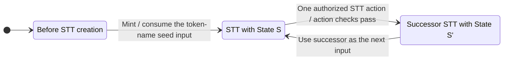
```mermaid
stateDiagram-v2
    direction LR
    state "Before STT creation" as Uncreated
    state "STT with State S" as Current
    state "Successor STT with State S'" as Next
    [*] --> Uncreated
    Uncreated --> Current: Mint / consume the token-name seed input
    Current --> Next: One authorized STT action / action checks pass
    Next --> Current: Use successor as the next input
```

VERIFIED: Recovery eligibility is a derived view of the state and transaction time.
The following diagram shows the recovery path with a fixed access configuration.
Operator updates and removals can change that configuration separately.
An elapsed deadline does not disable operators, allowance users, or eligible renewal users.
See [beneficiary time checks](../code/smart-contract/lib/state/proof_of_life.ak#L57),
[operator authority](../code/smart-contract/lib/state/authorization.ak#L123), and [user handlers](../code/smart-contract/lib/stt/user_handlers.ak#L36).

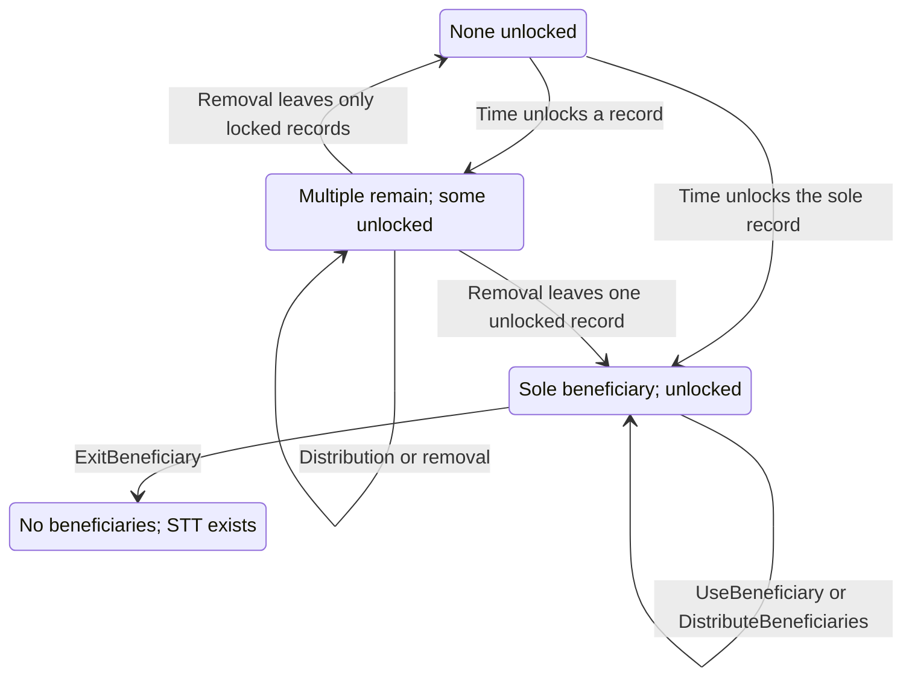
```mermaid
stateDiagram-v2
    direction TB
    state "None unlocked" as Waiting
    state "Multiple remain; some unlocked" as Multiple
    state "Sole beneficiary; unlocked" as Final
    state "No beneficiaries; STT exists" as Empty
    Waiting --> Multiple: Time unlocks a record
    Waiting --> Final: Time unlocks the sole record
    Multiple --> Final: Removal leaves one unlocked record
    Multiple --> Waiting: Removal leaves only locked records
    Multiple --> Multiple: Distribution or removal
    Final --> Final: UseBeneficiary or DistributeBeneficiaries
    Final --> Empty: ExitBeneficiary
```

VERIFIED: The final beneficiary remains listed after `UseBeneficiary`.
`ExitBeneficiary` removes it. `DistributeBeneficiaries` preserves the list.
These transitions follow [user_handlers.ak:224](../code/smart-contract/lib/stt/user_handlers.ak#L224),
[:269](../code/smart-contract/lib/stt/user_handlers.ak#L269), and [:343](../code/smart-contract/lib/stt/user_handlers.ak#L343).
The diagram does not imply that expiry itself spends a UTxO or writes a datum.
Removal means `UseBeneficiary` or `ExitBeneficiary` by the authorized actor.
Distribution requires all records unlocked and no streams. Final recovery and distribution use the shared cooldown.
Final exit also requires no streams. An authorized renewal can put either unlocked state back into `None unlocked`.

## Permissions and shared checks

VERIFIED permission definitions:

| Name used below | Exact contract condition | Executable evidence |
| --- | --- | --- |
| Admin | Any input-state user with `is_admin=True` has a listed wallet key in `extra_signatories`. | [authorization.ak:123](../code/smart-contract/lib/state/authorization.ak#L123) |
| Multisig | A positive configured threshold is met by the sum of positive powers of signed user records. Each record counts once. | [configuration.ak:266](../code/smart-contract/lib/state/configuration.ak#L266) |
| Operator | The selected `Admin` or `Multisig` path passes against the input state. | [authorization.ak:123](../code/smart-contract/lib/state/authorization.ak#L123) |
| Renewal user | A signed user has `is_admin=False` and `can_renew_proof_of_life=True`. | [user_handlers.ak:181](../code/smart-contract/lib/stt/user_handlers.ak#L181) |
| Allowance user | A key from the one changed user's `user_wallets` signs. | [user_handlers.ak:99](../code/smart-contract/lib/stt/user_handlers.ak#L99) |
| Unlocked beneficiary | A listed beneficiary key signs and transaction lower bound reaches that beneficiary's effective unlock. | [authorization.ak:44](../code/smart-contract/lib/state/authorization.ak#L44) |
| Single authorized beneficiary | Exactly one beneficiary record is both signed and unlocked. Its ID equals the declared ID. | [authorization.ak:97](../code/smart-contract/lib/state/authorization.ak#L97), [user_handlers.ak:410](../code/smart-contract/lib/stt/user_handlers.ak#L410) |
| Payee | The payout address has a verification-key payment credential, and that key signs. A script payee cannot use this signature path. | [authorization.ak:237](../code/smart-contract/lib/state/authorization.ak#L237) |

VERIFIED time rules: `L` and `U` denote the transaction's lower and upper bound values, in milliseconds.
`D = 86,400,000` milliseconds. The code reads finite bound values without inspecting their inclusivity flags.
See [time/bounds.ak:35](../code/smart-contract/lib/time/bounds.ak#L35) and [constants.ak:12](../code/smart-contract/lib/constants.ak#L12).

| Rule | Exact check | Executable evidence |
| --- | --- | --- |
| Beneficiary unlock | `L >= max(global_unlock, beneficiary.unlock_after)`. Missing personal timestamp uses the global timestamp. Missing global timestamp never unlocks. | [proof_of_life.ak:57](../code/smart-contract/lib/state/proof_of_life.ak#L57), [:144](../code/smart-contract/lib/state/proof_of_life.ak#L144) |
| Bounded renewal | If unlock changes: finite bounds, `new_unlock >= old_unlock`, `U <= new_unlock <= L + increment`. Dedicated renewal also requires a change. | [proof_of_life.ak:109](../code/smart-contract/lib/state/proof_of_life.ak#L109), [user_handlers.ak:58](../code/smart-contract/lib/stt/user_handlers.ak#L58) |
| Shared cooldown | Finite bounds, `U-L <= 3,600,000`. If a stamp exists, `L >= old_stamp + 1,800,000`. Set `new_stamp=Some(U)`. | [settlement_handlers.ak:187](../code/smart-contract/lib/stt/settlement_handlers.ak#L187), [constants.ak:150](../code/smart-contract/lib/constants.ak#L150) |

`unlock_after` is an absolute timestamp. It is not a duration added to the global deadline.
Renewal can occur after the old deadline if its other checks pass.
The cooldown applies to non-admin stream payouts, every cancel and beneficiary stop, and recovery/distribution with one input-state beneficiary.
An admin signature exempts only `PayStreamingPayment` from cooldown. Other actions retain their own rules.
See [payout authority](../code/smart-contract/lib/stt/settlement_handlers.ak#L120),
[stop checks](../code/smart-contract/lib/stt/settlement_handlers.ak#L297), and [beneficiary cadence](../code/smart-contract/lib/stt/user_handlers.ak#L386).

VERIFIED transaction boundaries: Wallet movement checks run when a wallet input is consumed.
An STT-only transition does not by itself prove that wallet funds moved.
Stream payout outputs are also checked on the STT side, so external inputs can fund a stream payout.
See [wallet spend](../code/smart-contract/lib/wallet/spend.ak#L22) and [STT payout](../code/smart-contract/lib/stt/settlement_handlers.ak#L62).

All wallet spends require a finite upper bound. Continuing wallet outputs must use the intended stake credential.
They cannot carry a reference script or datum hash. Wallet inputs are grouped by payment credential, including different stake variants.
See [wallet/spend.ak:49](../code/smart-contract/lib/wallet/spend.ak#L49),
[wallet/io.ak:125](../code/smart-contract/lib/wallet/io.ak#L125), and [stake_pinning.ak:26](../code/smart-contract/lib/wallet/stake_pinning.ak#L26).

The STT's intended stake credential changes only through `SetIntendedStakeCredential`.
The payout timestamp changes only through the cadence branches listed above.
Only a selected `RunOperator(Admin, ...)` path may attach a reference script to the successor STT.
See [central STT guards](../code/smart-contract/validators/stt.ak#L129).

Every action except `RunOperator(Use)` preserves all native assets at the STT and allows only ADA top-up.
`Use` can change ADA and other-policy assets at the STT while forwarding the STT token itself.
See [STT value check](../code/smart-contract/lib/stt/io.ak#L233) and [operator use](../code/smart-contract/lib/stt/operator_handlers.ak#L33).

## Every STT action and its permission

VERIFIED: Each branch below consumes `S` and produces its successor `S'`.
The labels summarize permissions. The tables supply action-specific limits and source evidence.

### Operator transitions

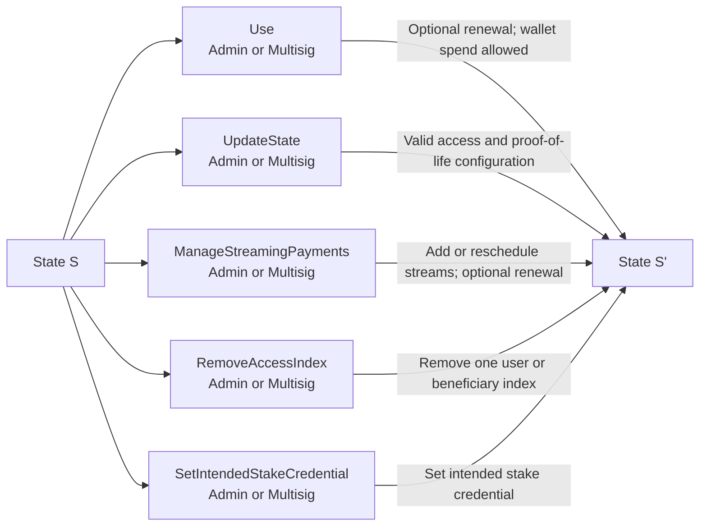
```mermaid
flowchart LR
    S["State S"] --> U["Use<br/>Admin or Multisig"]
    S --> C["UpdateState<br/>Admin or Multisig"]
    S --> M["ManageStreamingPayments<br/>Admin or Multisig"]
    S --> R["RemoveAccessIndex<br/>Admin or Multisig"]
    S --> K["SetIntendedStakeCredential<br/>Admin or Multisig"]
    U -->|"Optional renewal; wallet spend allowed"| N["State S'"]
    C -->|"Valid access and proof-of-life configuration"| N
    M -->|"Add or reschedule streams; optional renewal"| N
    R -->|"Remove one user or beneficiary index"| N
    K -->|"Set intended stake credential"| N
```

| Action | State effect and additional checks | Wallet inputs | Evidence |
| --- | --- | --- | --- |
| `RunOperator(Use)` | Only optional bounded proof-of-life renewal. Other datum fields stay fixed. | Allowed. Movement has no action-specific amount cap. Common reserve and output checks still apply. | [operator_handlers.ak:33](../code/smart-contract/lib/stt/operator_handlers.ak#L33), [rules.ak:82](../code/smart-contract/lib/wallet/rules.ak#L82) |
| `RunOperator(UpdateState)` | Replace valid access and proof-of-life settings. Preserve each stream's fields, stake target, and payout stamp. Only selected Admin path may rename the wallet. Stream order may change. | Rejected. | [operator_handlers.ak:97](../code/smart-contract/lib/stt/operator_handlers.ak#L97), [forwarding.ak:160](../code/smart-contract/lib/streaming_payments/forwarding.ak#L160) |
| `RunOperator(ManageStreamingPayments)` | Add fresh streams or change existing end dates. Preserve existing IDs, payees, assets, daily amounts, start dates, and paid amounts. No existing stream removal. Optional bounded renewal. | Rejected. | [operator_handlers.ak:134](../code/smart-contract/lib/stt/operator_handlers.ak#L134), [forwarding.ak:52](../code/smart-contract/lib/streaming_payments/forwarding.ak#L52) |
| `RunOperator(RemoveAccessIndex(target))` | Remove exactly one zero-based `UserIndex` or `BeneficiaryIndex`. Preserve other fields. Require a remaining admin, reachable multisig, or beneficiary path. | Rejected. | [operator_handlers.ak:194](../code/smart-contract/lib/stt/operator_handlers.ak#L194), [preservation.ak:228](../code/smart-contract/lib/stt/preservation.ak#L228) |
| `RunOperator(SetIntendedStakeCredential(target))` | Set only the intended credential to the redeemer target. Target is `None` or a valid key/script credential. | Rejected. Existing wallet outputs keep their addresses until a later spend. | [operator_handlers.ak:238](../code/smart-contract/lib/stt/operator_handlers.ak#L238), [credentials.ak:15](../code/smart-contract/lib/state/credentials.ak#L15) |

VERIFIED details: `UpdateState` validates the output configuration but does not apply the bounded-renewal rule to proof-of-life changes.
For stream management, an ordinary existing stream's new end must be at least `max(start+1, min(old_end, U))`.
Without a finite `U`, its floor is `old_end`. An existing zero-duration stream has floor `start`.
Operators can extend a previously shortened stream. Stream management itself does not inspect wallet funding.
See [state update](../code/smart-contract/lib/stt/operator_handlers.ak#L105) and [end-date floor](../code/smart-contract/lib/streaming_payments/forwarding.ak#L105).

Fresh streams require `paid_out_amount=0`, `start_date<end_date`, and a payout payment credential different from the STT script.
These checks apply at mint and when management adds a stream.
See [fresh stream checks](../code/smart-contract/lib/streaming_payments/shape.ak#L82).

### User and beneficiary transitions

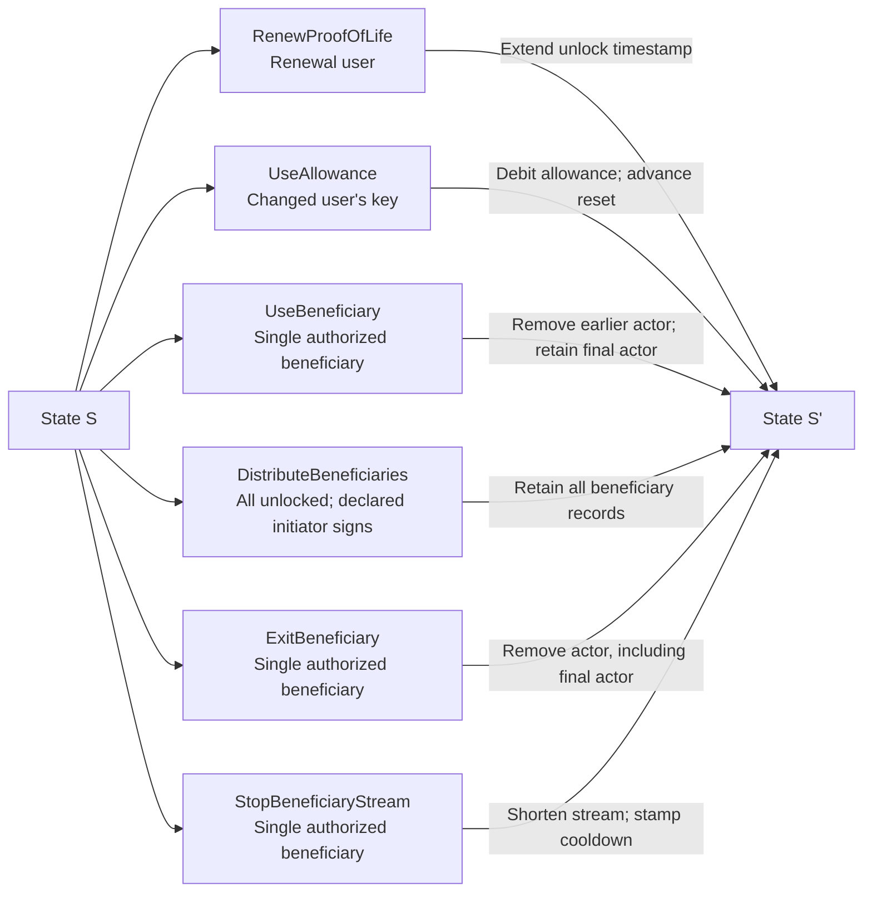
```mermaid
flowchart LR
    S["State S"] --> R["RenewProofOfLife<br/>Renewal user"]
    S --> A["UseAllowance<br/>Changed user's key"]
    S --> B["UseBeneficiary<br/>Single authorized beneficiary"]
    S --> D["DistributeBeneficiaries<br/>All unlocked; declared initiator signs"]
    S --> E["ExitBeneficiary<br/>Single authorized beneficiary"]
    S --> T["StopBeneficiaryStream<br/>Single authorized beneficiary"]
    R -->|"Extend unlock timestamp"| N["State S'"]
    A -->|"Debit allowance; advance reset"| N
    B -->|"Remove earlier actor; retain final actor"| N
    D -->|"Retain all beneficiary records"| N
    E -->|"Remove actor, including final actor"| N
    T -->|"Shorten stream; stamp cooldown"| N
```

| Action | State effect and additional checks | Wallet inputs | Evidence |
| --- | --- | --- | --- |
| `RenewProofOfLife` | Renewal user must strictly increase unlock within the bounded-renewal window. | Rejected. | [user_handlers.ak:36](../code/smart-contract/lib/stt/user_handlers.ak#L36), [:201](../code/smart-contract/lib/stt/user_handlers.ak#L201) |
| `UseAllowance(spent_assets)` | Exactly one user changes remaining allowance and reset. Declared spend equals the nonempty allowance decrease. Optional renewal requires that same user to be renewal-eligible. | Exact aggregate outflow equals declared spend. Recipient is unrestricted by this action. | [user_handlers.ak:76](../code/smart-contract/lib/stt/user_handlers.ak#L76), [allowance.ak:134](../code/smart-contract/lib/state/allowance.ak#L134) |
| `UseBeneficiary(id)` | Single authorized beneficiary. Remove actor when the input has multiple beneficiaries. Retain sole actor and apply cooldown. | Weighted-share cap for earlier actors. Sole actor can recover the free pool repeatedly. Recipient is unrestricted by this action. | [user_handlers.ak:224](../code/smart-contract/lib/stt/user_handlers.ak#L224), [rules.ak:108](../code/smart-contract/lib/wallet/rules.ak#L108) |
| `DistributeBeneficiaries(id)` | All beneficiaries unlocked, declared initiator signed, and no streams. Preserve beneficiary list. Apply cooldown only with one input-state beneficiary. | Exactly one wallet input, zero wallet change outputs. Pay tagged shares to every configured full payout address. | [user_handlers.ak:343](../code/smart-contract/lib/stt/user_handlers.ak#L343), [rules.ak:92](../code/smart-contract/lib/wallet/rules.ak#L92) |
| `ExitBeneficiary(id)` | Single authorized beneficiary. Always remove actor. Final exit also requires no streams and cooldown. | Actor's weighted-share cap, including 100% for final actor. Recipient is unrestricted by this action. | [user_handlers.ak:269](../code/smart-contract/lib/stt/user_handlers.ak#L269), [rules.ak:108](../code/smart-contract/lib/wallet/rules.ak#L108) |
| `StopBeneficiaryStream(beneficiary_id, stream_id)` | Single authorized beneficiary. Set target end exactly to `max(start, U)`, strictly below old end. Preserve paid amount and beneficiary list. Always apply cooldown. | Rejected. | [user_handlers.ak:308](../code/smart-contract/lib/stt/user_handlers.ak#L308), [settlement_handlers.ak:297](../code/smart-contract/lib/stt/settlement_handlers.ak#L297) |

VERIFIED allowance math: At `L >= old_reset`, available allowance becomes the daily grant. Otherwise, use the old remaining amount.
Every use sets `new_reset = max(old_reset, U+D)`, even when no reset was due.
See [allowance availability](../code/smart-contract/lib/state/allowance.ak#L228) and [next reset](../code/smart-contract/lib/state/allowance.ak#L260).

VERIFIED share math: For each withdrawn asset, the earlier beneficiary's cap is
`floor(weight * max(0, consumed_wallet_amount - reserve) / total_input_beneficiary_weight)`.
This uses consumed wallet inputs, not all funds at the wallet address. There is no minimum withdrawal.
Allowance, beneficiary use, and exit require wallet output count no greater than input count.
See [beneficiary_share.ak:46](../code/smart-contract/lib/wallet/beneficiary_share.ak#L46) and [wallet/rules.ak:31](../code/smart-contract/lib/wallet/rules.ak#L31).

VERIFIED reserves: An unsettled stream reserves `max(0, accrued_at(U)+1-paid_out_amount)` units of its asset.
A fully settled stream contributes zero. The extra unit is one lovelace for an ADA stream.
Operator use and final-beneficiary use check the full reserve. Allowance, earlier beneficiary use, and exit check reserves for withdrawn assets.
These checks prevent withdrawals from reducing protected funds. They do not require an actor to repair an existing shortfall.
See [funding.ak:332](../code/smart-contract/lib/streaming_payments/funding.ak#L332),
[reserve.ak:35](../code/smart-contract/lib/wallet/reserve.ak#L35), and [funding checks](../code/smart-contract/lib/streaming_payments/funding.ak#L119).

VERIFIED distribution math: Every asset must divide exactly by beneficiary weights.
For each beneficiary, require `(quantity * weight) % total_weight == 0`.
Exactly one tagged output must reach its configured full address. Native assets must equal the calculated share exactly.
ADA may exceed its calculated share through external top-up. No extra native assets may appear in that payout output.
Mint and `UpdateState` reject beneficiary destinations with the STT payment credential, including stake variants.
The maintained frontend rejects the derived wallet credential during creation and update.
Distribution does not repeat either comparison. Its zero-wallet-output rule still excludes destinations with the wallet payment credential.
This differs from the rounded cap and free recipient choice of individual beneficiary recovery.
See [beneficiary_distribution.ak:12](../code/smart-contract/lib/wallet/beneficiary_distribution.ak#L12).
The configuration check is in [beneficiary destination validation](../code/smart-contract/lib/state/configuration.ak#L313).
The wallet output rule is in [rules.ak:92](../code/smart-contract/lib/wallet/rules.ak#L92).

### Settlement transitions

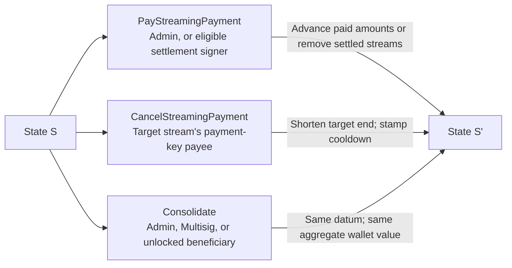
```mermaid
flowchart LR
    S["State S"] --> P["PayStreamingPayment<br/>Admin, or eligible settlement signer"]
    S --> C["CancelStreamingPayment<br/>Target stream's payment-key payee"]
    S --> G["Consolidate<br/>Admin, Multisig, or unlocked beneficiary"]
    P -->|"Advance paid amounts or remove settled streams"| N["State S'"]
    C -->|"Shorten target end; stamp cooldown"| N
    G -->|"Same datum; same aggregate wallet value"| N
```

| Action | Permission and state effect | Wallet inputs | Evidence |
| --- | --- | --- | --- |
| `PayStreamingPayment(payout_delta)` | Admin can settle and preserve the stamp. Before sole-beneficiary unlock, any user, any stream payee, or unlocked beneficiary can settle with cooldown. After that unlock, only the sole beneficiary can use the non-admin path. | Exact declared outflow to tagged configured payee outputs. Wallet output count cannot increase. External funding without wallet inputs also works. | [settlement_handlers.ak:38](../code/smart-contract/lib/stt/settlement_handlers.ak#L38), [:120](../code/smart-contract/lib/stt/settlement_handlers.ak#L120), [rules.ak:153](../code/smart-contract/lib/wallet/rules.ak#L153) |
| `CancelStreamingPayment(id)` | Target payee signs. Require `max(start,U) <= new_end < old_end`. After sole-beneficiary unlock, require exact `new_end=max(start,U)`. Always apply cooldown. | Rejected. No payout or stream removal occurs. | [settlement_handlers.ak:260](../code/smart-contract/lib/stt/settlement_handlers.ak#L260), [forwarding.ak:136](../code/smart-contract/lib/streaming_payments/forwarding.ak#L136) |
| `Consolidate(path)` | `AdminPath`, `MultisigPath`, or `BeneficiaryPath` authority. Preserve all state fields and the payout stamp. | Preserve aggregate value exactly. Merge or split outputs. No output-count cap. | [authorization.ak:170](../code/smart-contract/lib/state/authorization.ak#L170), [settlement_handlers.ak:361](../code/smart-contract/lib/stt/settlement_handlers.ak#L361), [rules.ak:179](../code/smart-contract/lib/wallet/rules.ak#L179) |

VERIFIED payout details: Both time bounds must be finite for all payouts, including admin payouts.
Admin payouts do not apply the one-hour width limit or thirty-minute cooldown.
Partial payouts cannot exceed unpaid accrual at `L`. Retained streams keep owing some lifetime value.
Matured or already fully settled entries can leave the list, with their unpaid remainder paid on removal.
Payout cannot add or reorder streams. A zero-progress payout is also accepted when its other checks pass.
See [payout authority](../code/smart-contract/lib/stt/settlement_handlers.ak#L126),
[retained entries](../code/smart-contract/lib/streaming_payments/payout.ak#L171),
[removal](../code/smart-contract/lib/streaming_payments/payout.ak#L235), and [payout amount](../code/smart-contract/lib/streaming_payments/payout.ak#L296).

VERIFIED routing: A positive stream payment requires the configured full address and an inline payout tag.
The tag contains the stream ID and consumed STT reference. Wallet-funded payouts also check all outgoing payout assets.
Cancellation preserves stream fields except the target end date, but may reorder the stream list because matching uses IDs.
See [tagged payment checks](../code/smart-contract/lib/streaming_payments/payout.ak#L363),
[wallet routing](../code/smart-contract/lib/wallet/payout_routing.ak#L45), and [ID matching](../code/smart-contract/lib/streaming_payments/forwarding.ak#L176).

## Separate example cycles

All examples in this section are INFERRED illustrations, not executed transactions.
`S` denotes the complete datum. Unmentioned fields remain unchanged.
Examples without stated streams use an empty stream list. Time labels are offsets from a valid example origin.

### 1. Mint the STT

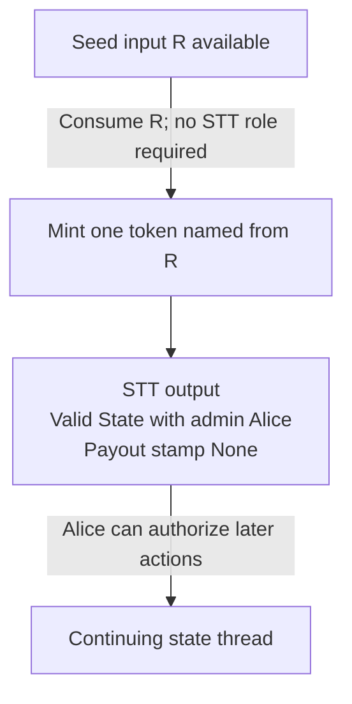
```mermaid
flowchart TB
    A["Seed input R available"] -->|"Consume R; no STT role required"| B["Mint one token named from R"]
    B --> C["STT output<br/>Valid State with admin Alice<br/>Payout stamp None"]
    C -->|"Alice can authorize later actions"| D["Continuing state thread"]
```

VERIFIED rule: Mint validates configuration and fresh unpaid streams, and requires one token under its policy.
Beneficiary payout addresses must not use the STT payment credential.
Its name is `blake2b_256(transaction_id || uint32be(output_index))` for a consumed input.
The STT output uses the policy's script payment credential, no stake credential, and an inline datum.
It cannot carry a reference script or native assets other than that single STT.
This creates a state thread. It is not a repeatable mint on that same thread.
Evidence: [stt.ak:60](../code/smart-contract/validators/stt.ak#L60), [stt/io.ak:55](../code/smart-contract/lib/stt/io.ak#L55), [:118](../code/smart-contract/lib/stt/io.ak#L118).

### 2. RunOperator(Use)

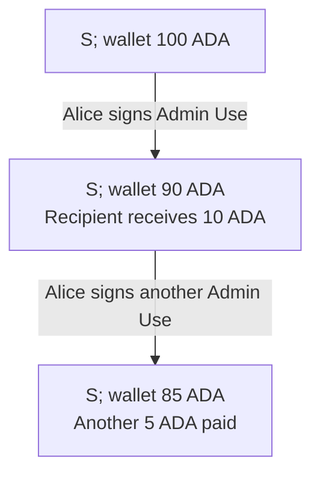
```mermaid
flowchart TB
    A["S; wallet 100 ADA"] -->|"Alice signs Admin Use"| B["S; wallet 90 ADA<br/>Recipient receives 10 ADA"]
    B -->|"Alice signs another Admin Use"| C["S; wallet 85 ADA<br/>Another 5 ADA paid"]
```

INFERRED alternative: Users with powers 2 and 1 can sign the same cycle through `Multisig` with threshold 3.
The example preserves proof of life. Either operator path can optionally renew it within the renewal window.
Evidence: [operator use](../code/smart-contract/lib/stt/operator_handlers.ak#L33), [multisig sum](../code/smart-contract/lib/state/configuration.ak#L266).

### 3. RunOperator(UpdateState)

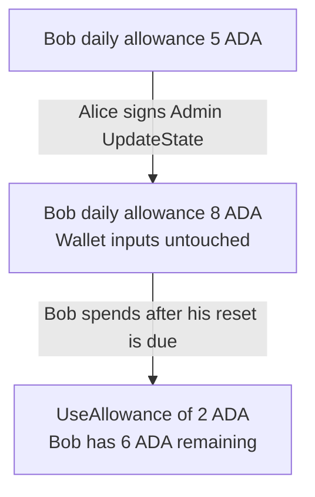
```mermaid
flowchart TB
    A["Bob daily allowance 5 ADA"] -->|"Alice signs Admin UpdateState"| B["Bob daily allowance 8 ADA<br/>Wallet inputs untouched"]
    B -->|"Bob spends after his reset is due"| C["UseAllowance of 2 ADA<br/>Bob has 6 ADA remaining"]
```

VERIFIED rule: The new configuration must pass full validation. Current input-state authority authorizes the change.
Beneficiary payout addresses must not use the STT payment credential. The maintained frontend also checks the derived wallet credential.
The output beneficiary destinations must not use the STT payment credential. An update can replace an incompatible input destination.
Multisig can also update access and proof of life, but its selected path cannot rename the wallet.
Evidence: [state update](../code/smart-contract/lib/stt/operator_handlers.ak#L97), [allowance reset](../code/smart-contract/lib/state/allowance.ak#L228).

### 4. RunOperator(ManageStreamingPayments)

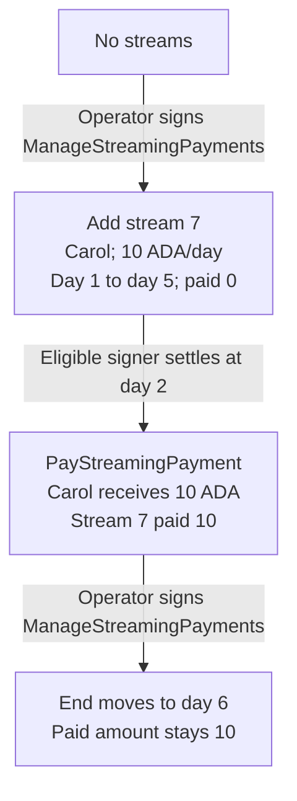
```mermaid
flowchart TB
    A["No streams"] -->|"Operator signs ManageStreamingPayments"| B["Add stream 7<br/>Carol; 10 ADA/day<br/>Day 1 to day 5; paid 0"]
    B -->|"Eligible signer settles at day 2"| C["PayStreamingPayment<br/>Carol receives 10 ADA<br/>Stream 7 paid 10"]
    C -->|"Operator signs ManageStreamingPayments"| D["End moves to day 6<br/>Paid amount stays 10"]
```

VERIFIED rule: Both Admin and Multisig can run management. Creating the stream does not itself transfer or reserve a separate funding UTxO.
Evidence: [management](../code/smart-contract/lib/stt/operator_handlers.ak#L134), [forwarding](../code/smart-contract/lib/streaming_payments/forwarding.ak#L52).

### 5. RunOperator(RemoveAccessIndex)

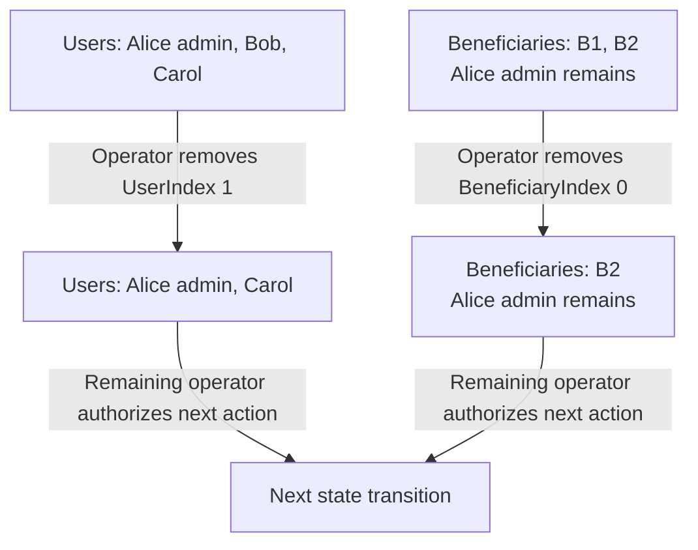
```mermaid
flowchart TB
    A["Users: Alice admin, Bob, Carol"] -->|"Operator removes UserIndex 1"| B["Users: Alice admin, Carol"]
    C["Beneficiaries: B1, B2<br/>Alice admin remains"] -->|"Operator removes BeneficiaryIndex 0"| D["Beneficiaries: B2<br/>Alice admin remains"]
    B -->|"Remaining operator authorizes next action"| E["Next state transition"]
    D -->|"Remaining operator authorizes next action"| E
```

VERIFIED rule: Targets are zero-based positions in the input lists, not stored user or beneficiary IDs.
Both operator paths work. At least one permitted access path must remain.
Evidence: [remove handler](../code/smart-contract/lib/stt/operator_handlers.ak#L194), [list removal](../code/smart-contract/lib/stt/preservation.ak#L228).

### 6. RunOperator(SetIntendedStakeCredential)

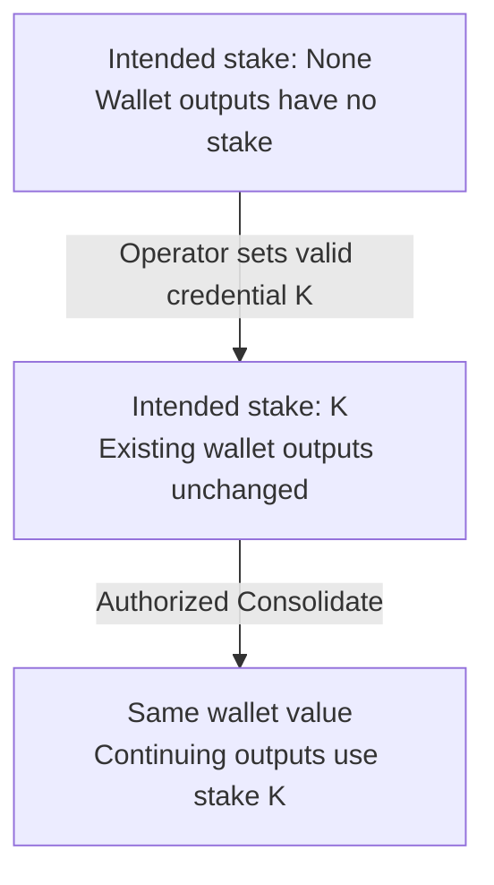
```mermaid
flowchart TB
    A["Intended stake: None<br/>Wallet outputs have no stake"] -->|"Operator sets valid credential K"| B["Intended stake: K<br/>Existing wallet outputs unchanged"]
    B -->|"Authorized Consolidate"| C["Same wallet value<br/>Continuing outputs use stake K"]
```

VERIFIED rule: The target can be `None`, a key credential, or a script credential.
The later wallet spend applies the new target. The STT output's own full address remains pinned.
Evidence: [stake setter](../code/smart-contract/lib/stt/operator_handlers.ak#L238), [wallet stake check](../code/smart-contract/lib/wallet/stake_pinning.ak#L69).

### 7. RenewProofOfLife

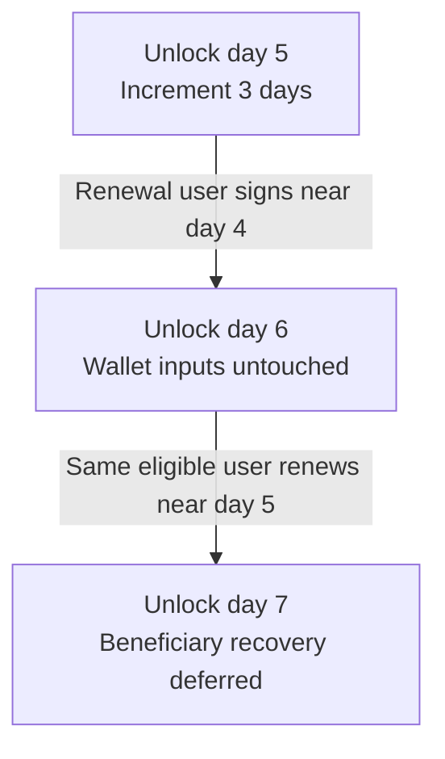
```mermaid
flowchart TB
    A["Unlock day 5<br/>Increment 3 days"] -->|"Renewal user signs near day 4"| B["Unlock day 6<br/>Wallet inputs untouched"]
    B -->|"Same eligible user renews near day 5"| C["Unlock day 7<br/>Beneficiary recovery deferred"]
```

INFERRED intervals: First use `[4D,4D+60,000]`, then `[5D,5D+60,000]`.
Both new deadlines strictly increase and satisfy `U <= new_unlock <= L+3D`.
An admin uses operator `Use` for optional renewal. Admin status alone does not permit this dedicated action.
Evidence: [dedicated renewal](../code/smart-contract/lib/stt/user_handlers.ak#L36), [eligibility](../code/smart-contract/lib/stt/user_handlers.ak#L201).

### 8. UseAllowance

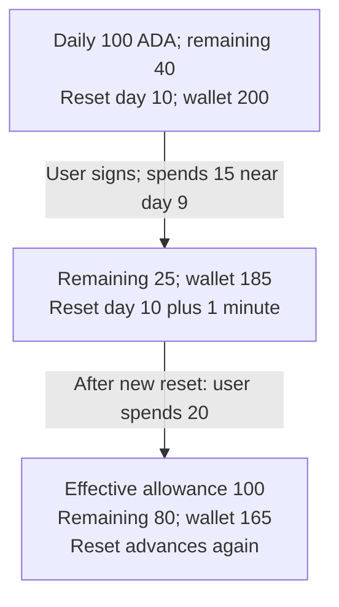
```mermaid
flowchart TB
    A["Daily 100 ADA; remaining 40<br/>Reset day 10; wallet 200"] -->|"User signs; spends 15 near day 9"| B["Remaining 25; wallet 185<br/>Reset day 10 plus 1 minute"]
    B -->|"After new reset: user spends 20"| C["Effective allowance 100<br/>Remaining 80; wallet 165<br/>Reset advances again"]
```

INFERRED first interval: `[9D,9D+60,000]`. Therefore the first new reset is `10D+60,000`.
The example leaves proof of life unchanged. The second spend uses a lower bound at or after that new reset.
Evidence: [allowance transition](../code/smart-contract/lib/state/allowance.ak#L134), [reset calculation](../code/smart-contract/lib/state/allowance.ak#L260).

### 9. UseBeneficiary

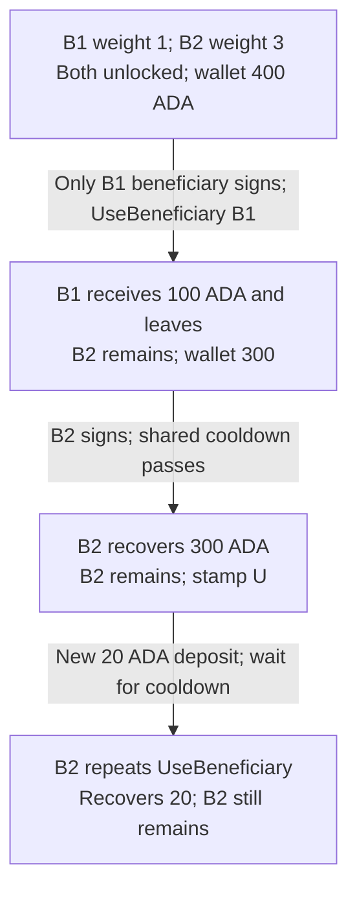
```mermaid
flowchart TB
    A["B1 weight 1; B2 weight 3<br/>Both unlocked; wallet 400 ADA"] -->|"Only B1 beneficiary signs; UseBeneficiary B1"| B["B1 receives 100 ADA and leaves<br/>B2 remains; wallet 300"]
    B -->|"B2 signs; shared cooldown passes"| C["B2 recovers 300 ADA<br/>B2 remains; stamp U"]
    C -->|"New 20 ADA deposit; wait for cooldown"| D["B2 repeats UseBeneficiary<br/>Recovers 20; B2 still remains"]
```

INFERRED setup: The first transaction consumes the entire 400 ADA pool. No streams exist.
The first removal preserves the prior stamp. B2's first recovery must respect that prior stamp if present.
The final branch permits future recovery because it retains B2.
Evidence: [beneficiary use](../code/smart-contract/lib/stt/user_handlers.ak#L224), [share cap](../code/smart-contract/lib/wallet/beneficiary_share.ak#L69).

### 10. DistributeBeneficiaries

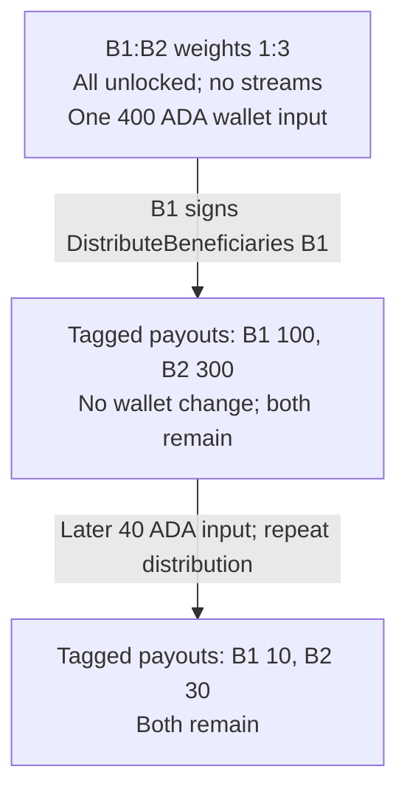
```mermaid
flowchart TB
    A["B1:B2 weights 1:3<br/>All unlocked; no streams<br/>One 400 ADA wallet input"] -->|"B1 signs DistributeBeneficiaries B1"| B["Tagged payouts: B1 100, B2 300<br/>No wallet change; both remain"]
    B -->|"Later 40 ADA input; repeat distribution"| C["Tagged payouts: B1 10, B2 30<br/>Both remain"]
```

VERIFIED rule: All beneficiaries must be unlocked, but only the declared initiator needs to sign.
Each payout uses its configured address and a tag bound to the current STT input.
With multiple beneficiaries, this cycle preserves the cooldown stamp. A singleton distribution uses cooldown.
Evidence: [distribution authority](../code/smart-contract/lib/stt/user_handlers.ak#L343), [exact shares](../code/smart-contract/lib/wallet/beneficiary_distribution.ak#L12).

### 11. ExitBeneficiary

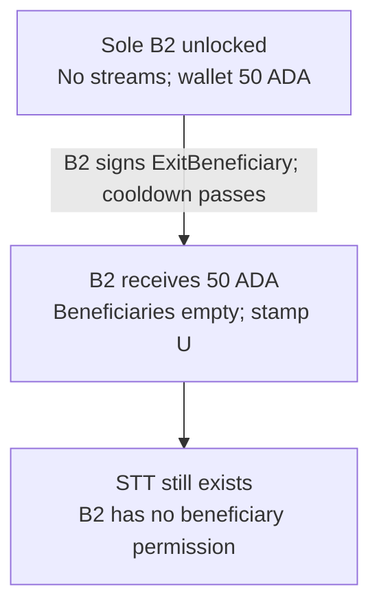
```mermaid
flowchart TB
    A["Sole B2 unlocked<br/>No streams; wallet 50 ADA"] -->|"B2 signs ExitBeneficiary; cooldown passes"| B["B2 receives 50 ADA<br/>Beneficiaries empty; stamp U"]
    B --> C["STT still exists<br/>B2 has no beneficiary permission"]
```

VERIFIED rule: Earlier beneficiaries can also exit under their weighted-share cap. They preserve the stamp.
Final exit requires an empty stream list and removes the final beneficiary.
This sequence ends that beneficiary's access. Separately configured operator access remains.
Evidence: [exit handler](../code/smart-contract/lib/stt/user_handlers.ak#L269), [state preservation](../code/smart-contract/lib/stt/preservation.ak#L182).

### 12. StopBeneficiaryStream

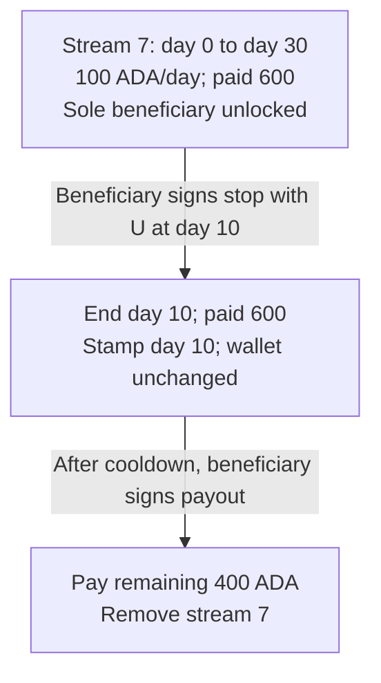
```mermaid
flowchart TB
    A["Stream 7: day 0 to day 30<br/>100 ADA/day; paid 600<br/>Sole beneficiary unlocked"] -->|"Beneficiary signs stop with U at day 10"| B["End day 10; paid 600<br/>Stamp day 10; wallet unchanged"]
    B -->|"After cooldown, beneficiary signs payout"| C["Pay remaining 400 ADA<br/>Remove stream 7"]
```

INFERRED stop interval: `[10D-60,000,10D]`. The existing stamp permits this interval.
The stop fixes lifetime value at 1,000 ADA. Later settlement pays the unpaid 400 ADA.
The payee does not need to sign the stop.
Evidence: [beneficiary stop](../code/smart-contract/lib/stt/user_handlers.ak#L308), [exact cutoff](../code/smart-contract/lib/stt/settlement_handlers.ak#L328).

### 13. PayStreamingPayment

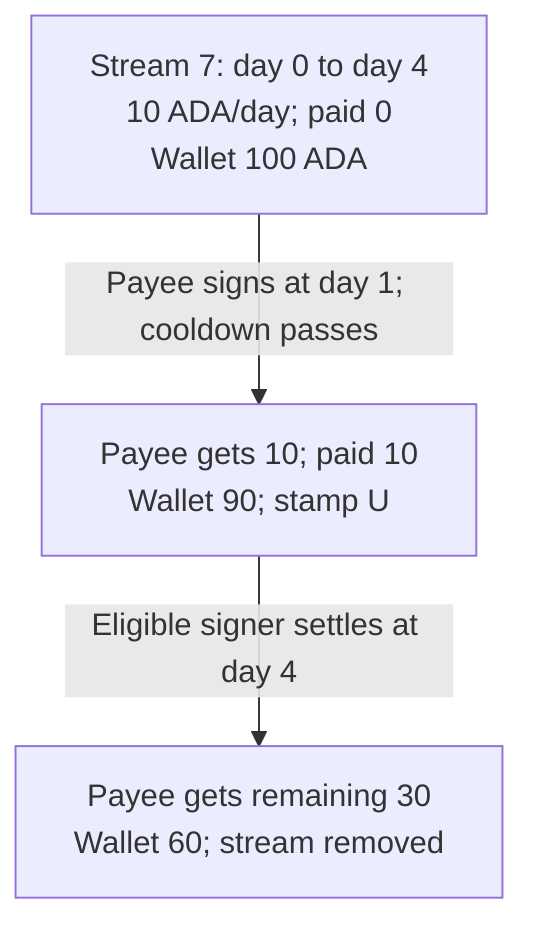
```mermaid
flowchart TB
    A["Stream 7: day 0 to day 4<br/>10 ADA/day; paid 0<br/>Wallet 100 ADA"] -->|"Payee signs at day 1; cooldown passes"| B["Payee gets 10; paid 10<br/>Wallet 90; stamp U"]
    B -->|"Eligible signer settles at day 4"| C["Payee gets remaining 30<br/>Wallet 60; stream removed"]
```

INFERRED intervals: Use `L=D, U=D+60,000` for the first payment.
Use `L=4D, U=4D+60,000` for the second. The payee can sign while final recovery is inactive.
After final recovery activates, an admin or the sole beneficiary signs settlement instead.
An admin can execute the same payments without advancing the cooldown stamp.
Evidence: [settlement authority](../code/smart-contract/lib/stt/settlement_handlers.ak#L120), [retained payout ceiling](../code/smart-contract/lib/streaming_payments/payout.ak#L296).

### 14. CancelStreamingPayment

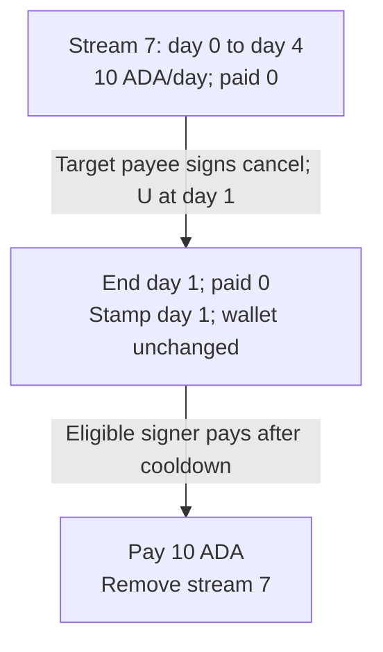
```mermaid
flowchart TB
    A["Stream 7: day 0 to day 4<br/>10 ADA/day; paid 0"] -->|"Target payee signs cancel; U at day 1"| B["End day 1; paid 0<br/>Stamp day 1; wallet unchanged"]
    B -->|"Eligible signer pays after cooldown"| C["Pay 10 ADA<br/>Remove stream 7"]
```

INFERRED cancel interval: `[D-60,000,D]`, with prior stamp `None`.
Set `end=D`. This also satisfies the exact cutoff required after final recovery opens.
The later payout needs its own authorized signer. Cancel permission alone does not grant payout permission after final recovery.
Evidence: [cancel](../code/smart-contract/lib/stt/settlement_handlers.ak#L260), [cutoff bounds](../code/smart-contract/lib/streaming_payments/forwarding.ak#L136).

### 15. Consolidate, each permission path

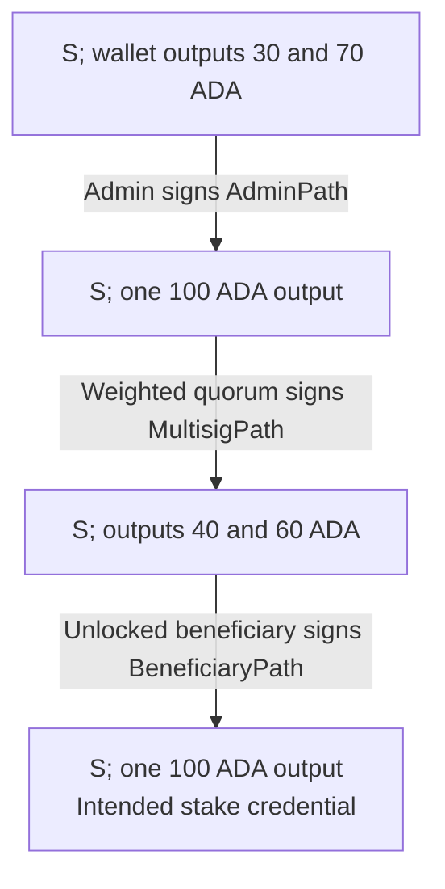
```mermaid
flowchart TB
    A["S; wallet outputs 30 and 70 ADA"] -->|"Admin signs AdminPath"| B["S; one 100 ADA output"]
    B -->|"Weighted quorum signs MultisigPath"| C["S; outputs 40 and 60 ADA"]
    C -->|"Unlocked beneficiary signs BeneficiaryPath"| D["S; one 100 ADA output<br/>Intended stake credential"]
```

INFERRED setup: The state has an admin, a reachable multisig threshold, and an unlocked beneficiary.
Every step has a finite upper bound. The beneficiary step also has a finite lower bound that reaches its unlock.
Each step preserves every asset, all state fields, and the cooldown stamp. External inputs pay the fees.
Evidence: [consolidation paths](../code/smart-contract/lib/state/authorization.ak#L170), [value equality](../code/smart-contract/lib/wallet/rules.ak#L179).

## Wallet governance actions and their cycles

VERIFIED: `withdraw`, `publish`, and `vote` each require a simultaneous STT `RunOperator(Use)` transition.
The wallet redeemer selects Admin or Multisig, and that path must exactly match the STT action's path.
The transaction may contain at most two redeemers. These examples use one STT spend and one wallet governance purpose.
The authorization helper does not inspect the account, certificate, or voter payload beyond this shared gate.
Ledger validity still applies. Beneficiary authority alone does not authorize these entrypoints.
Evidence: [wallet.ak:33](../code/smart-contract/validators/wallet.ak#L33), [:83](../code/smart-contract/validators/wallet.ak#L83),
[transaction_shape.ak:8](../code/smart-contract/lib/transaction_shape.ak#L8), [constants.ak:87](../code/smart-contract/lib/constants.ak#L87).

### 16. withdraw

```mermaid
flowchart TB
    A["State S; reward withdrawal available"] -->|"Admin signs matching Use and withdraw paths"| B["State S continues<br/>Ledger processes withdrawal"]
    B -->|"Later rewards; repeat with valid authority"| C["Next withdrawal"]
```

INFERRED: This example preserves proof of life. Multisig can use the same entrypoint with matching paths.
Evidence: [withdraw entrypoint](../code/smart-contract/validators/wallet.ak#L33), [operator-use handshake](../code/smart-contract/validators/wallet.ak#L83).

### 17. publish

```mermaid
flowchart TB
    A["State S; valid certificate prepared"] -->|"Quorum signs matching Use and publish paths"| B["State S continues<br/>Ledger processes certificate"]
    B -->|"Later valid certificate; repeat"| C["Next certificate action"]
```

INFERRED: This example uses Multisig and preserves proof of life. Admin can use the same entrypoint.
Evidence: [publish entrypoint](../code/smart-contract/validators/wallet.ak#L46), [operator-use handshake](../code/smart-contract/validators/wallet.ak#L83).

### 18. vote

```mermaid
flowchart TB
    A["State S; valid vote prepared"] -->|"Admin signs matching Use and vote paths"| B["State S continues<br/>Ledger processes vote"]
    B -->|"Later valid vote; repeat"| C["Next vote action"]
```

INFERRED: This example preserves proof of life. Multisig can use the same entrypoint with matching paths.
Evidence: [vote entrypoint](../code/smart-contract/validators/wallet.ak#L59), [operator-use handshake](../code/smart-contract/validators/wallet.ak#L83).

## Receiving funds and rejected actions

VERIFIED: Receiving a new wallet output is not an STT redeemer action.
The wallet's spend handler consumes wallet inputs and ignores their datum and redeemer arguments.
It does not impose an STT transition merely to create a new deposit output.
The diagram's deposit is an external ledger event.
Evidence: [wallet entrypoint](../code/smart-contract/validators/wallet.ak#L15), [spend implementation](../code/smart-contract/lib/wallet/spend.ak#L22).

```mermaid
flowchart TB
    A["State S; wallet 0 ADA"] -->|"Sender creates a 20 ADA wallet output"| B["Same STT and State S<br/>Wallet has 20 ADA"]
    B -->|"Later authorized wallet spend with STT action"| C["Successor STT; wallet value follows action"]
```

VERIFIED rejection inventory:

| Requested purpose | Result | Executable evidence |
| --- | --- | --- |
| STT burn or close | No accepted action. Mint requires `+1`; spend forwards the STT. | [stt.ak:60](../code/smart-contract/validators/stt.ak#L60), [stt/io.ak:182](../code/smart-contract/lib/stt/io.ak#L182) |
| STT withdraw, publish, vote, or propose | Fallback fails. | [stt.ak:52](../code/smart-contract/validators/stt.ak#L52) |
| Wallet mint | Always returns `False`. | [wallet.ak:93](../code/smart-contract/validators/wallet.ak#L93) |
| Wallet propose or any other unsupported purpose | Fallback fails. | [wallet.ak:64](../code/smart-contract/validators/wallet.ak#L64) |
| Spend the STT reference store | Always fails. Its other purposes also fail. | [stt_reference_store.ak:10](../code/smart-contract/validators/stt_reference_store.ak#L10) |

```mermaid
flowchart TB
    A["Reference-store output exists"] -->|"Any spend attempt"| B["Rejected<br/>Output remains unspent"]
    C["Unsupported validator purpose"] --> D["Rejected<br/>No state transition"]
```

## Verification limits

VERIFIED method: The permission tables and transitions were traced through executable dispatchers, handlers, and their called helpers.
Every action section links that code. Comments were excluded as behavior evidence.
The examples describe selected successful paths. They do not enumerate every possible transaction shape or replace ledger validation.
No contract source changed, and no transaction was signed or submitted for this document.

VERIFIED artifact checks: The Mermaid preview reported `25 diagrams, 0 errors`.
The local link check reported `Source links: 138 Invalid: 0`.
These checks cover diagram rendering and source-link targets. They do not execute the example transactions.

Review correction: The first draft described distribution top-ups too broadly.
The installed `aiken-lang/stdlib v3.1.0` applies `>=` only to ADA in `assets.match`.
Its `lib/cardano/assets.ak:446` checks `left_assets == builtin.map_data(right_assets)` for native assets.
The distribution section now states exact native-asset shares and ADA-only top-ups.
