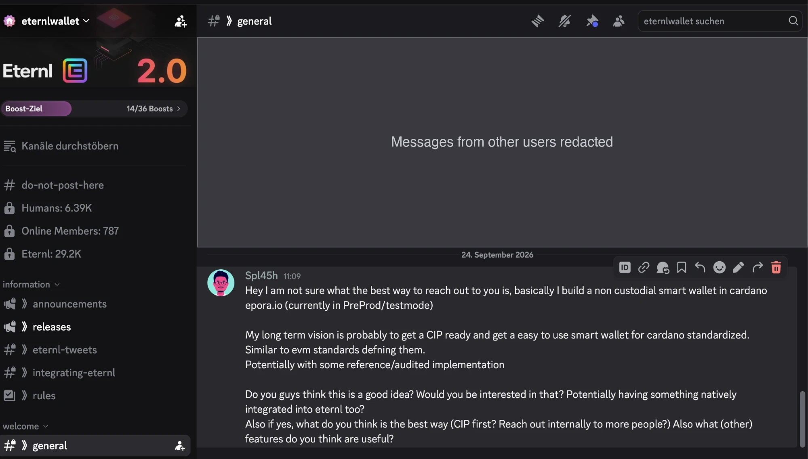

# Wallet integration outreach (Milestone 5)

This page is the Catalyst evidence link for the discussion about potential wallet integrations.
Milestone 5 asks for communication with potential wallet developers, if wallet developers or the community express interest.

**Snapshot:** 2026-09-26.

**Milestone task: completed.**
There have been various contact requests, to verify some included in here are the [Discord screenshot](#eternl-message) shows the outreach message asking Eternl about a native integration and a smart-wallet CIP.

Other contacts have been made, but further discussions are product follow-ups, and partially not an open outreach deliverable. The message can also be verified when joining the discord channel linked below

| Wallet | Outreach | Status |
| --- | --- | --- |
| Eternl | Public [message in the Eternl Discord](https://discord.com/channels/907178289263681566/1102250263382872105/1552607968682319964), `#general`, 24 September 2026. See the [screenshot](#eternl-message). | Communication complete. Reply by direct message (DM), reported by Sandro. Integration follow-up remains future work. |
| Begin Wallet | Contacted by DM. | Communication complete |
| Other wallet developers | Contacted. | Communication complete |

## Eternl message

In the message, Sandro (Discord user `Spl45h`) introduces epora.io and a plan to standardize a Cardano smart wallet through a CIP.
The message asks if Eternl is interested, including a native integration into Eternl.

The Discord link needs a sign-in, so the screenshot below shows the same message.
We redacted the messages from other users.

